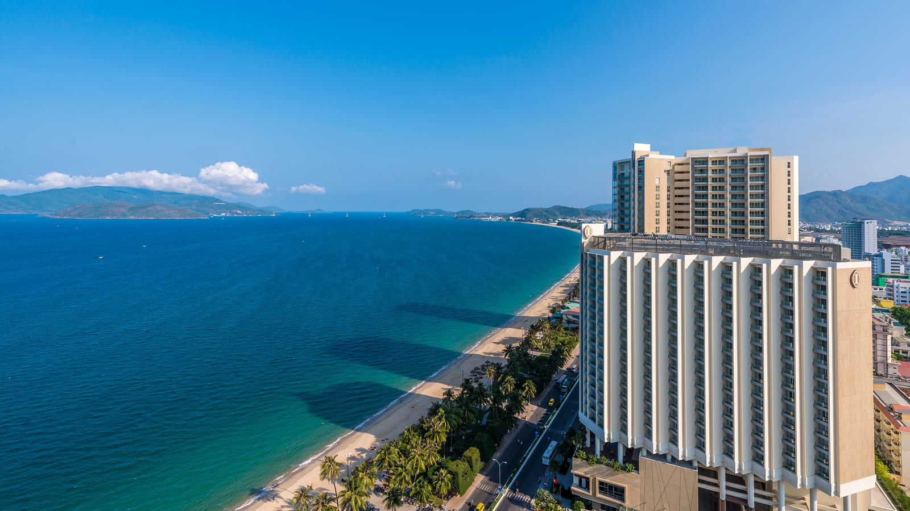
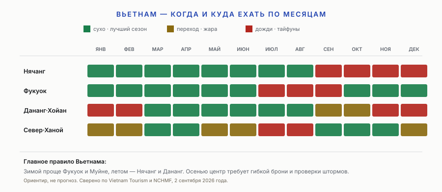
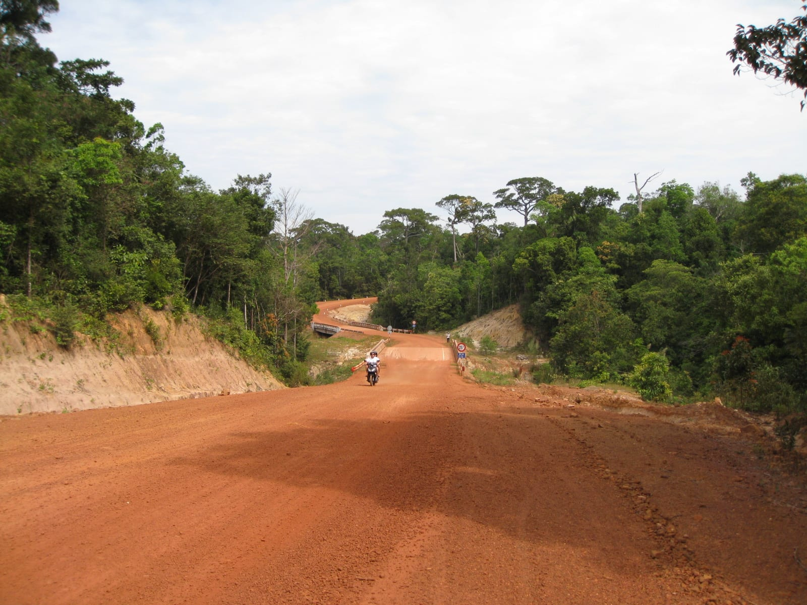
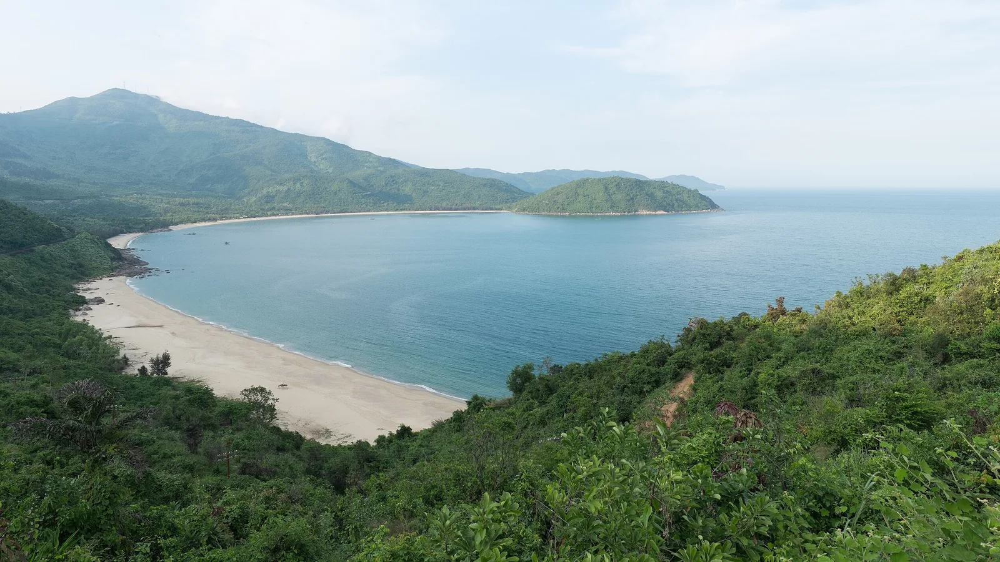
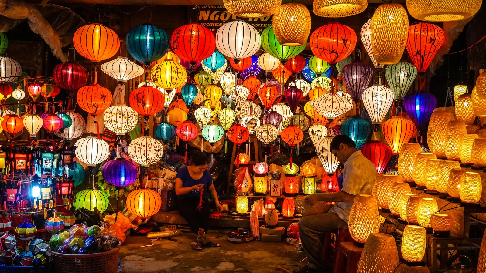
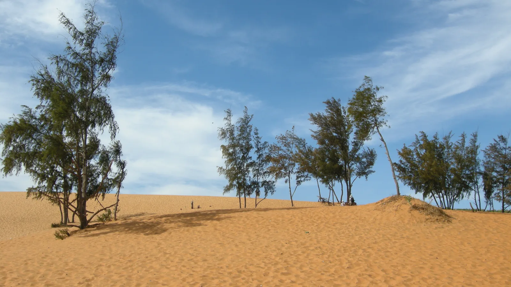
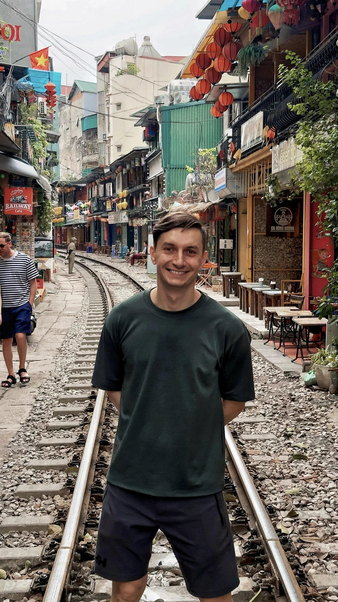
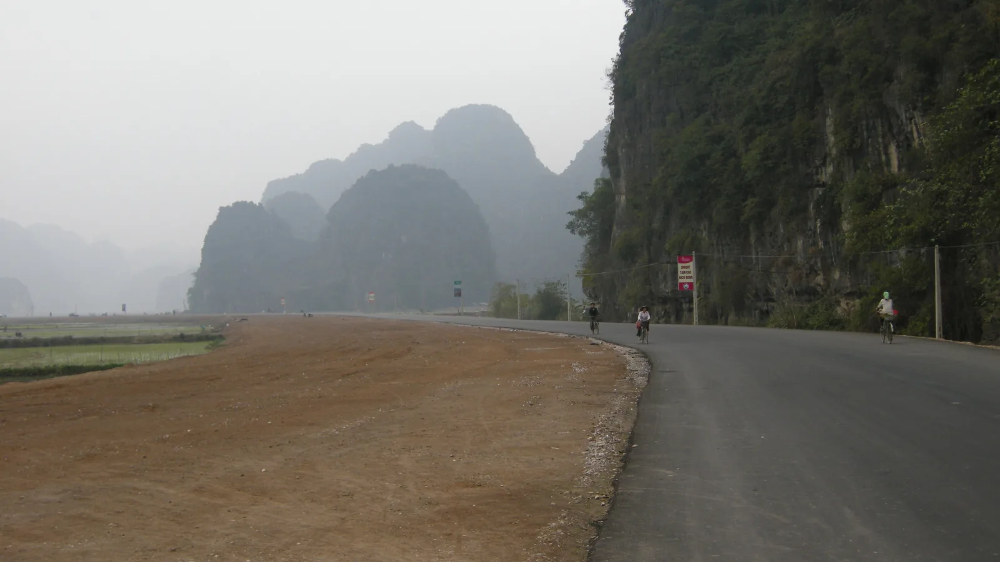

import AffiliateNote from '../../components/post/AffiliateNote.astro';
import CountryMap from '../../components/CountryMap.astro';
import { TP_LINKS, aviasalesRoute, cherehapaCountry, ostrovokCity } from '../../data/affiliate.js';

export const flights = aviasalesRoute('MOW', 'CXR', 'vietnam_guide_2026_flights', 9);
export const stay = ostrovokCity('vietnam', 'nha_trang', 'vietnam_guide_2026_stay');
export const insurance = cherehapaCountry('vietnam', 'vietnam_guide_2026_insurance');
export const tours = `${TP_LINKS.travelata}&sub_id=vietnam_guide_2026_tours`;

В январе на Фукуоке обычно сухо, а в Дананге ещё идут дожди. В июле ситуация меняется: море у Дананга и Нячанга спокойнее, зато на Фукуоке ливни и высокая влажность. Поэтому вопрос «когда ехать во Вьетнам» без названия региона почти бессмысленен.

> **Если коротко:** для первой поездки с пляжем проще всего выбрать **март или апрель** — в это окно пересекаются хорошие условия на нескольких побережьях. Зимой надёжнее смотреть **Фукуок и Муйне**, летом — **Нячанг и Дананг**. В сентябре–ноябре центр страны требует особой осторожности из-за сильных дождей, штормов и возможных подтоплений. Климатическая таблица — фильтр для выбора, а не гарантия погоды на конкретную неделю.

<AffiliateNote />

## Вьетнам по месяцам: куда ехать

Официальный туристический портал Вьетнама даёт разные сезонные окна даже соседним регионам. Для Нячанга он относит к ясному периоду январь–август, для Фукуока — октябрь–июнь. В Дананге лучшими названы март–май и сентябрь–октябрь, а июнь–август описаны как ясные месяцы со спокойным морем. Для связки Дананг—Хойан осенью всё равно нужен запас: в Хойане дожди и риск наводнений начинаются раньше.

| Месяц | Первый выбор | Что учитывать |
|---|---|---|
| январь | Фукуок, Муйне; Нячанг по прогнозу | в центре страны дождливо, на севере прохладно и пасмурно |
| февраль | Фукуок, Нячанг, Муйне | на севере сырость и туман, во время Тета транспорт загружен |
| март | Нячанг, Фукуок, Дананг—Хойан | одно из лучших окон для комбинированного маршрута |
| апрель | Нячанг, Дананг—Хойан, Фукуок | жарче по всей стране, но ещё можно совместить несколько регионов |
| май | Нячанг, Дананг; север в начале месяца | на Фукуоке растут влажность и вероятность ливней |
| июнь | Нячанг, Дананг | на севере жарко и дождливо, на Фукуоке начинается мокрый период |
| июль | Нячанг, Дананг | Фукуок штормовой и влажный; в Ханое душно и часты ливни |
| август | Нячанг, Дананг с проверкой прогноза | к концу месяца в центре растёт штормовой риск |
| сентябрь | север; Нячанг только с гибкой бронью | переходный месяц, центр нельзя считать гарантированно сухим |
| октябрь | север; Фукуок ближе к концу месяца | в Дананге и Хойане возможны тайфуны, ливни и подтопления |
| ноябрь | Фукуок, Муйне; север | Нячанг и центральное побережье часто дождливые |
| декабрь | Фукуок, Муйне | в центре ещё мокро, на севере вечерами нужна тёплая одежда |

Это усреднённая картина. Перед невозвратной бронью проверьте краткосрочный прогноз и предупреждения [Национального центра гидрометеорологических прогнозов Вьетнама](https://nchmf.gov.vn/). Особенно важна проверка для центрального побережья с сентября по декабрь.

## Нячанг: удобнее с января по август

Нячанг подходит тем, кому нужен не изолированный остров, а город у моря: длинная набережная, кафе, рынки, дайвинг и возможность жить без трансферов между отелем и центром. Январь–август официальный туристический портал описывает как жаркий, солнечный и ясный период. С сентября по декабрь становится прохладнее, дождливее и облачнее.

**Минусы:** городской пляж не даёт ощущения уединённого острова, трафик шумный, а осенью море бывает неспокойным. Для короткого отпуска в октябре–ноябре Нячанг — более рискованный выбор, чем Фукуок или Муйне.

Если выбираете только между двумя главными курортами, отдельный материал [сравнивает Нячанг и Фукуок по пляжам, атмосфере и формату отдыха](/blog/nyachang-fukuok-2026/). Здесь главный критерий другой — месяц поездки.

<a href={stay} class="aff-cta" rel="sponsored">Сравнить отели Нячанга</a> — проверьте один и тот же район, даты и условия отмены.

## Фукуок: сухое окно с октября по июнь

Фукуок удобен для спокойного пляжного отпуска без длинного маршрута по стране. По данным Vietnam Tourism, июль–сентябрь здесь штормовые, жаркие и душные, а октябрь–июнь — более ясные и солнечные. На практике октябрь и май–июнь остаются переходными: дешёвая цена не отменяет вероятность дождя.

**Минусы:** островной формат сужает выбор вылазок, популярные пляжи застроены, а переезд на материк съедает время. В высокий зимний сезон жильё и прямые пакеты стоит сравнивать заранее, но не по рекламной цене «от».

## Дананг и Хойан: море летом, осторожность осенью

Дананг — рабочий компромисс между пляжем и поездками: из города легко добраться до Хойана, перевала Хайван и бывшей императорской столицы Хюэ. Официальный портал называет март–май и сентябрь–октябрь лучшими месяцами, а июнь–август — ясными и подходящими для спокойного моря.

Но сентябрь–октябрь нельзя читать как обещание безоблачного отпуска. Для соседнего Хойана тот же портал отмечает дождливый период с сентября по январь, тропические штормы с сентября и риск наводнений с сентября по ноябрь. Для пляжа без запасного плана безопаснее март–август; сентябрь–октябрь подходят при гибкой броне и ежедневной проверке предупреждений.

**Минусы:** осенний ливень может закрыть пляж и осложнить дорогу в Хойан. В жаркие летние месяцы прогулки по старому городу лучше переносить на утро и вечер.

## Муйне и север: два запасных сценария

**Муйне** полезен как зимняя альтернатива Фукуоку: сухой юг материка, дюны и возможность совместить пляж с Хошимином. Цена такого выбора — длинный наземный трансфер и ветреное море; курорт особенно любят кайтсёрферы, но не всем подходит для спокойного плавания.

**Север** нужен не ради тропического пляжа. Для Ханоя официальный портал рекомендует апрель–июнь и сентябрь–декабрь, но к июню растут жара и дожди. Зимой температура иногда опускается примерно до 10 °C, а февраль–март бывают туманными. Лучшие практические окна для маршрута Ханой—Ниньбинь — апрель и октябрь–ноябрь.

Я был именно на севере: в Ханое, Ниньбине и деревне благовоний Куангфукау. Это не «добавка к пляжу», а отдельная поездка — с карстами, плотным городом и короткими выездами из Ханоя. На неё стоит оставлять хотя бы три полных дня, а не пытаться вставить север одной стыковкой.

## Что меняет прогноз 2026–2027

Долгосрочный бюллетень вьетнамского гидрометцентра ожидает переход к Эль-Ниньо с августа 2026 года по январь 2027-го. Для августа–октября средняя температура прогнозировалась примерно на 0,5–1 °C выше нормы, на севере — местами на 1–1,5 °C. Осадков во многих регионах ожидалось меньше обычного; с ноября по январь для полосы Куангчи—Дананг указан дефицит порядка 10–25%.

Это не превращает осень в центре в сухой сезон. Тот же бюллетень предупреждает о сильных дождях в центральных провинциях в ноябре–декабре, опасном ветре на море и локальных экстремумах. На 2027 год жара может начаться раньше обычного. Климатическая норма помогает выбрать регион, а решение по конкретным датам принимают по прогнозу за несколько дней.

## На сколько дней ехать

| Срок | Реалистичный маршрут | Что не стоит добавлять |
|---|---|---|
| 7 дней | один курорт: Нячанг, Фукуок или Дананг | второй дальний регион и ночной переезд «для галочки» |
| 10 дней | Дананг + Хойан или курорт + Хошимин | одновременно север, центр и юг |
| 14 дней | один пляжный регион + Ханой и Ниньбинь | три пляжных курорта с одинаковым опытом |
| 21 день | север + центр + юг с двумя внутренними перелётами | автобус через всю страну ради небольшой экономии |

<CountryMap slug="vietnam" countryNom="Вьетнам" />

Маршрут на 14 дней лучше собирать вокруг сезона. Зимой логична связка **Фукуок — Хошимин — Ханой**, весной можно соединить **Дананг — Хойан — Ханой**, летом — **Нячанг — Дананг**. Если поездка только пляжная, второй курорт обычно даёт меньше пользы, чем ещё три спокойных дня в одном месте.

## Цена поездки: свежий билет и честный ориентир

2 сентября 2026 года прямой рейс Москва—Камрань на 15–29 октября стоил на Авиасейлсе **129 408 ₽ туда-обратно на одного**: 10 ч 10 мин туда, 11 ч 05–35 мин обратно, багаж 23 кг и ручная кладь 10 кг. Это один живой срез на конкретные даты, а не «обычная цена» и не обещание тарифа.

<a href={flights} class="aff-cta" rel="sponsored">Проверить перелёт Москва — Камрань</a> — маршрут и октябрь заданы, точные даты выберите в форме.

Для расходов на месте используйте три плановых уровня из нашей базы 2026 года: **около 2 250 ₽ в день** без перелёта для бюджетной поездки, **4 500 ₽** для среднего уровня и **9 000 ₽** для заметно более комфортного. Это оценка на еду, жильё, местный транспорт и занятия, основанная на региональном бюджете Indie Traveller, а не котировка отеля. На десять дней получается примерно **22 500 / 45 000 / 90 000 ₽ на человека** плюс международный билет, страховка и крупные переезды. Пересчитайте под свои даты в [калькуляторе поездки](/calculator/).

Пакет и самостоятельную сборку сравнивайте в один момент и на одинаковые даты. В пакет должны входить тот же аэропорт, багаж, трансфер и одинаковый тип номера — иначе «дешевле» ничего не доказывает.

<a href={tours} class="aff-cta" rel="sponsored">Сравнить пакетные туры во Вьетнам</a> — перенесите в поиск те же даты и состав туристов.

## Пять готовых решений

1. **Пляж в январе–феврале:** Фукуок или Муйне. Нячанг оставьте запасным вариантом после проверки моря и прогноза.
2. **Первая поездка в марте–апреле:** Дананг + Хойан, затем Ханой и Ниньбинь. Это самое удобное окно для маршрута, а не только курорта.
3. **Отпуск с детьми в июне–августе:** Нячанг или Дананг. Фукуок в эти месяцы не стоит выбирать только из-за скидки.
4. **Поездка в октябре–ноябре:** север плюс Фукуок или Муйне. Дананг и Хойан — только с гибкой отменой и запасным планом.
5. **Две недели зимой:** один южный пляжный регион и три–четыре дня на севере. Не возите чемодан через три похожих курорта.

## Документы и риски — без дублирования

Правила въезда меняются быстрее климата, поэтому здесь нет второй визовой инструкции. Перед поездкой проверьте актуальный безвизовый срок, электронную визу и карту прибытия в отдельном [разборе въезда во Вьетнам](/blog/vietnam-visa-2026/) и на официальном [портале e-Visa](https://evisa.gov.vn/).

Главные бытовые риски — не «опасная страна», а трафик, аренда скутера без нужного опыта и документов, ливни, жара и обезвоживание. Для поездки на байке важно, чтобы этот риск был прямо включён в полис, а не подразумевался.

<a href={insurance} class="aff-cta" rel="sponsored">Сравнить страховки для Вьетнама</a> — отдельно отметьте мотобайк, дайвинг и другие активные занятия.

Итоговая логика простая: **зимой — Фукуок и Муйне, летом — Нячанг и Дананг, весной — самый широкий выбор, осенью — север и особая осторожность в центре**. После выбора региона проверьте [таблицу сезонов](/seasons/), затем снимите перелёт и жильё на одни даты. Так месяц действительно влияет на поездку, а не остаётся строкой в рекламной таблице.

---

*Материал пересмотрен 2 сентября 2026 года. Сезонные окна сверены по [официальному климатическому обзору Vietnam Tourism](https://www.vietnam.travel/vi/things-to-do/weather-and-climate-vietnam), раздел по Данангу — по [официальной странице региона](https://www.vietnam.travel/places-to-go/central-vietnam/da-nang), отклонения 2026–2027 — по [годовому бюллетеню NCHMF](https://nchmf.gov.vn/kttvsite/vi-VN/1/ban-tin-du-bao-khi-hau-thoi-han-nam-tren-pham-vi-toan-quoc-tu-thang-8-nam-2026-den-thang-7-nam-2027-post53543.html). Цена перелёта зафиксирована на [Авиасейлсе](https://www.aviasales.ru/search/MOW1510CXR29101) в день проверки. Личный опыт и фотографии автора относятся только к северу Вьетнама.*

*Фото Нячанга, Фукуока, Дананга, Хойана, Муйне и Ниньбиня: Wikimedia Commons; авторы и лицензии указаны в данных изображений. Фото Куангфукау — из архива автора.*
