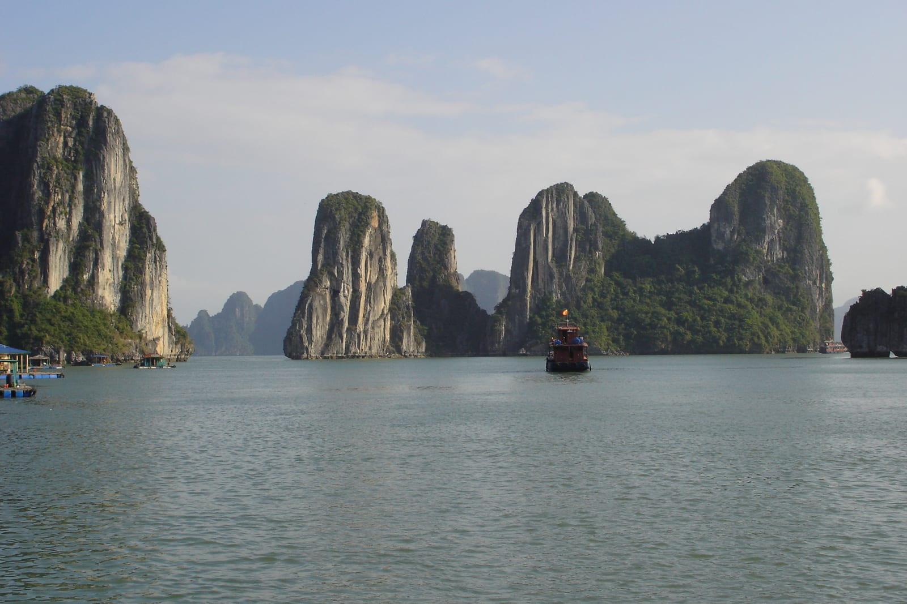
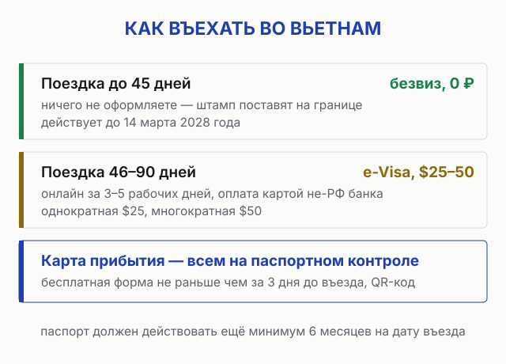
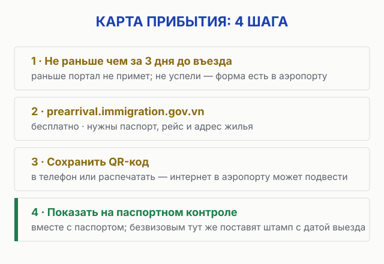
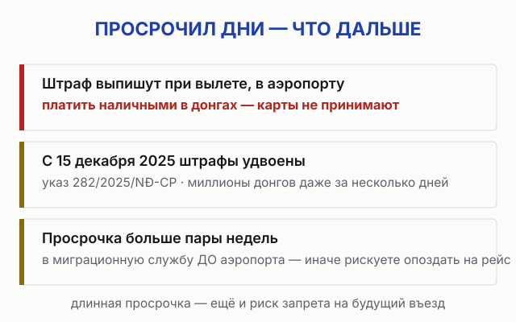

import AffiliateNote from '../../components/post/AffiliateNote.astro';
import { aviasalesRoute, cherehapaTravel, drimsimSub } from '../../data/affiliate.js';

С визой во Вьетнам сейчас парадокс: она большинству россиян вообще не нужна — и при этом именно на въезде люди ловят проблемы. Причина в том, что карту прибытия вводили тремя этапами за одну весну — сначала один аэропорт, потом Фукуок, потом все, — а требования к электронной визе живут на двух похожих государственных порталах. Я прошёл по всем первоисточникам — порталу e-Visa, порталу карты прибытия и разборам АТОР — и собрал состояние правил на август 2026 в одном месте.

> **Если коротко:** россиянам **виза во Вьетнам не нужна до 45 дней** — безвиз продлён **до 14 марта 2028**. Дольше — **e-Visa на 90 дней**: $25 однократная (≈2 100 ₽, курс ЦБ 13.08.2026), $50 многократная (≈4 150 ₽), онлайн за 3–5 рабочих дней. Новое правило 2026 года: **электронная карта прибытия нужна всем, кто проходит паспортный контроль** (транзит без выхода из зоны — исключение). Бесплатная форма на портале иммиграционной службы, открывается **не ранее чем за 72 часа до прилёта**; на контроле показываете QR-код. Загранпаспорт — от 6 месяцев на дату въезда. Прямые рейсы в Нячанг летают круглый год: <a href={aviasalesRoute('MOW','CXR','vietnam_visa_2026')} class="aff-cta" rel="sponsored">Найти билет Москва — Нячанг от 24 000 ₽</a> — сравнивает все авиакомпании сразу.

<AffiliateNote />

---

## Нужна ли виза во Вьетнам россиянам в 2026 году?

**Нет — если поездка укладывается в 45 дней.** Безвизовый режим для граждан России действует с августа 2023 года и резолюцией правительства Вьетнама от 7 марта 2025 года продлён **до 14 марта 2028-го**. Цель поездки не важна: туризм, гости, деловая поездка — всё подходит. На границе в паспорт ставят штамп с датой, до которой нужно выехать.

Считайте дни внимательно: день прилёта и день вылета входят в срок. Поездка «на полтора месяца» — это уже не безвиз: 46 дней и больше требуют визу, и оформлять её нужно до вылета, а не по факту.

## Что нужно на границе при безвизовом въезде?

Список короткий, но спросить могут любой пункт — чаще на регистрации рейса, чем на самой границе:

* **Загранпаспорт** со сроком действия **минимум 6 месяцев** на дату въезда;
* **обратный билет** или билет в третью страну — формальное требование, спрашивают выборочно, но без него авиакомпания вправе не посадить;
* **адрес первого жилья** — он нужен и для карты прибытия;
* **QR-код электронной карты прибытия** — про неё следующий раздел, это главное новшество года.

Формальных требований к сумме на счету и броням на весь срок нет — в этом Вьетнам заметно проще Таиланда и тем более Шенгена. Но последнее слово всегда за стойкой регистрации и пограничником, поэтому базовый набор документов держите под рукой.

## Что за электронная карта прибытия и как её заполнить?

**С 22 июня 2026 электронная карта прибытия обязательна во всех международных аэропортах Вьетнама** — и в Камрани (Нячанг), и в Ханое, и в Хошимине, и на Фукуоке. Вводили её этапами: с 15 апреля — аэропорт Хошимина, с 1 июня — Фукуок, с 22 июня — все международные аэропорты ([разбор АТОР](https://www.atorus.ru/article/vetnam-zapuskaet-cifrovuyu-kartu-pribytiya-chto-nuzhno-znat-turistam-67558)).

Порядок такой: **не ранее чем за 72 часа до прилёта** открываете официальный портал иммиграционной службы [prearrival.immigration.gov.vn](https://prearrival.immigration.gov.vn/), заполняете форму — паспорт, рейс, адрес первого жилья — и получаете **QR-код**. Сохраняете его в телефон или распечатываете и показываете на паспортном контроле вместе с паспортом.

Три вещи, которые важно знать:

* **Это не виза и не отменяет визу.** Это анкета, которую власти хотят видеть до вашего прилёта, — нужна и безвизовым, и владельцам e-Visa.
* **Она бесплатная.** Сторонние сайты предлагают «помощь с заполнением» за деньги — форма занимает 3–5 минут, платить не за что. Заполняйте только на официальном портале.
* **Исключение одно** — транзит без выхода из зоны паспортного контроля. Все остальные иностранцы заполняют, независимо от гражданства и наличия визы.

Если рейс перенесли и вы выпали из 72-часового окна — форму можно отправить заново с новыми данными рейса.

## Как оформить e-Visa, если едете дольше 45 дней?

Электронная виза выдаётся на **срок до 90 дней**, однократная или многократная — это официальный продукт Управления иммиграции МВД Вьетнама, оформляется полностью онлайн на портале [evisa.gov.vn](https://evisa.gov.vn/).

Процедура из трёх шагов: заполняете анкету на английском, платите сбор на самом портале, получаете визу на почту через **3–5 рабочих дней**. Подавайте минимум за две недели до вылета: портал иногда думает дольше заявленного, а сбор при отказе не возвращается. Из документов нужны скан загранпаспорта и цифровое фото без очков на светлом фоне. Распечатайте полученную визу — её спрашивают на регистрации и на границе.

| Виза | Срок | Цена | Где оформлять |
|---|---|---|---|
| Не нужна (безвиз) | до 45 дней | 0 ₽ | нигде — только штамп на границе |
| e-Visa однократная | до 90 дней | $25 | evisa.gov.vn |
| e-Visa многократная | до 90 дней | $50 | evisa.gov.vn |

Цены — визовый сбор портала; он не возвращается при отказе. Никаких «сервисных сборов» сверху у государства нет — если с вас просят больше, вы на сайте посредника.

## Чем оплатить визовый сбор из России?

Главная практическая засада e-Visa для россиян — оплата. Портал принимает карты **Visa и Mastercard, выпущенные не российскими банками**: карты РФ не проходят из-за отключения от международных систем. Рабочие варианты — карта иностранного банка (Казахстан, Армения, Грузия, ОАЭ), виртуальная карта иностранного сервиса или помощь знакомых с зарубежной картой.

Если оформляете поездку целиком, продумайте это заранее — та же проблема встретится при оплате некоторых отелей и сервисов внутри страны. Как платить россиянину за границей в 2026-м, мы разбирали отдельно: [карты, наличные и обходные пути](/blog/pay-abroad-2026/).

## Можно ли остаться дольше: продление и новый въезд

Продлить безвизовые 45 дней на месте нельзя — механизма продления штампа нет. Рабочие сценарии два:

* **Оформить e-Visa заранее**, если знаете, что едете надолго: 90 дней — вдвое больше безвиза. На классическую зимовку в 4–5 месяцев одной визы всё равно не хватит — понадобится выезд и новый въезд.
* **Выехать и въехать заново** — в Камбоджу или Лаос и обратно. Формально запрета на повторный безвизовый въезд нет, и многие зимовщики так делают. Но помните: решение о въезде каждый раз принимает пограничник, частые «обнуления» подряд могут вызвать вопросы, а гарантий никто не даёт. Это не лазейка в законе, а его серая зона.

Карта прибытия при этом привязана к конкретному въезду — при каждом новом въезде её заполняют заново, старый QR-код не действует. Правило сформулировано для международных аэропортов; как оно применяется на наземных переходах, официальные источники пока не описывают — перед визараном по земле сверьтесь с порталом.

Для долгой жизни во Вьетнаме — работы, бизнеса, учёбы — нужны другие типы виз через консульство, это отдельная история не про туризм.

## Что будет за просрочку безвиза или визы?

Просрочка даже на день — это штраф при вылете. С **15 декабря 2025 года** штрафы подняли указом 282/2025/NĐ-CP — верхние планки выросли вдвое. Точная сумма зависит от числа дней просрочки; в открытых источниках вилки расходятся, но счёт идёт на **миллионы донгов** — это тысячи и десятки тысяч рублей.

Что из этого следует:

* штраф выписывают **в аэропорту при вылете**, платить — **наличными в донгах**, карты не принимают: закладывайте наличные и время;
* при просрочке больше пары недель не тяните до аэропорта — обращайтесь в миграционную службу заранее, иначе рискуете опоздать на рейс из-за оформления;
* серьёзная просрочка — это ещё и риск запрета на будущий въезд.

Дешевле всего просто посчитать дни в календаре в день прилёта и поставить напоминание за неделю до дедлайна.

## Нужна ли страховка для въезда во Вьетнам?

**Для въезда — нет:** в отличие от Грузии или Шенгена, Вьетнам полис на границе не требует. Но медицина для иностранцев здесь платная, а частые поводы обратиться — ожоги от солнца, отравления, мопедные травмы — во Вьетнаме случаются чаще, чем хотелось бы. Приём в международной клинике без полиса стоит от $50–100, госпитализация — сотни долларов в сутки.

<a href={cherehapaTravel('vietnam_visa_2026')} class="aff-cta" rel="sponsored">Сравнить страховки во Вьетнам от 300 ₽</a> — агрегатор показывает цены и ассистанс разных компаний, оплата картой РФ, полис приходит в PDF.

## Связь и документы в телефоне: что подготовить до вылета

QR-код и визу сохраните так, чтобы открывались без сети. А вот такси, карты и связь с хозяином жилья по прилёте без интернета не работают — роуминг РФ-операторов во Вьетнаме дорогой, локальную сим-карту в аэропорту продают с наценкой. Удобный вариант — поставить eSIM ещё дома и включить по прилёте: <a href={drimsimSub('vietnam_visa_2026')} class="aff-cta" rel="sponsored">Оформить eSIM для Вьетнама</a> — работает сразу, оплата из России.

Чек-лист файлов в телефоне перед вылетом: QR-код карты прибытия, PDF визы (если оформляли), обратный билет, бронь первого жилья, фото разворота паспорта.

## FAQ

**Сколько можно находиться во Вьетнаме без визы в 2026 году?**
45 дней, включая день прилёта и день вылета. Безвизовый режим для россиян продлён до 14 марта 2028 года.

**Что за QR-код требуют при въезде во Вьетнам?**
Это электронная карта прибытия — с 22 июня 2026 она обязательна во всех международных аэропортах страны. Заполняется бесплатно на официальном портале иммиграционной службы не ранее чем за 72 часа до прилёта, занимает 3–5 минут.

**Сколько стоит виза во Вьетнам для россиян?**
До 45 дней — нисколько, виза не нужна. Электронная e-Visa на срок до 90 дней стоит $25 однократная и $50 многократная; платить нужно картой не российского банка.

**Можно ли оформить визу по прилёте?**
Для туриста практический ответ — нет: рассчитывать нужно на безвиз или заранее оформленную e-Visa. Схемы «visa on arrival» через посреднические письма-приглашения — источник переплат и проблем; государственный портал надёжнее.

**Виза во Вьетнам для ребёнка оформляется отдельно?**
Да, e-Visa оформляется на каждого человека отдельно, включая детей с собственным загранпаспортом. Карту прибытия тоже заполняют на каждого въезжающего. Если ребёнок летит без родителей — понадобится нотариальное согласие на выезд по российским правилам.

**Обратный билет правда проверяют?**
Выборочно, но требование существует, и авиакомпания на регистрации вправе спросить. Дешевле иметь билет, чем спорить у стойки.

---

## Что почитать дальше

- [Вьетнам 2026: гайд по стране](/blog/vietnam-guide-2026/) — сезоны, маршруты, цены и кухня
- [Нячанг и Фукуок: куда из двух](/blog/nyachang-fukuok-2026/) — сравнение главных курортов
- [Виза во Вьетнам — краткая справка](/visa/vietnam/) — статусы и сроки одной таблицей
- [Как платить за границей россиянам 2026](/blog/pay-abroad-2026/) — карты, наличные, обходные пути
- [Зимовка в тепле: где и почём](/blog/thailand-guide-2026/) — сосед-конкурент Вьетнама по зимовке

---

*Материал носит справочный характер. Визовые правила меняются — перед поездкой сверяйте условия на официальных порталах: [e-Visa](https://evisa.gov.vn/) и [карта прибытия](https://prearrival.immigration.gov.vn/). Проверял по первоисточникам 12 августа 2026. Нашли неточность — напишите в [Telegram-канал @traveltriberu](https://t.me/traveltriberu), обновлю.*

*Фото: Ondřej Žváček (бухта Халонг) / [Wikimedia Commons](https://commons.wikimedia.org/w/index.php?curid=2520505) / [CC BY 2.5](https://creativecommons.org/licenses/by/2.5/). Схемы наши.*
