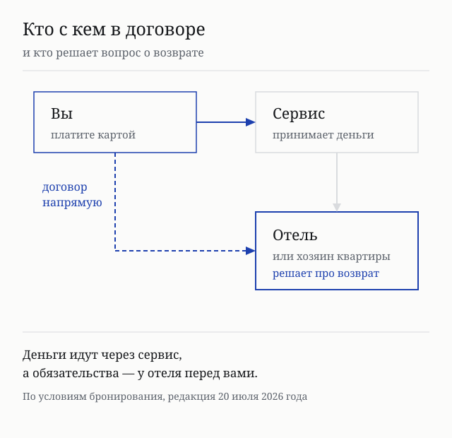
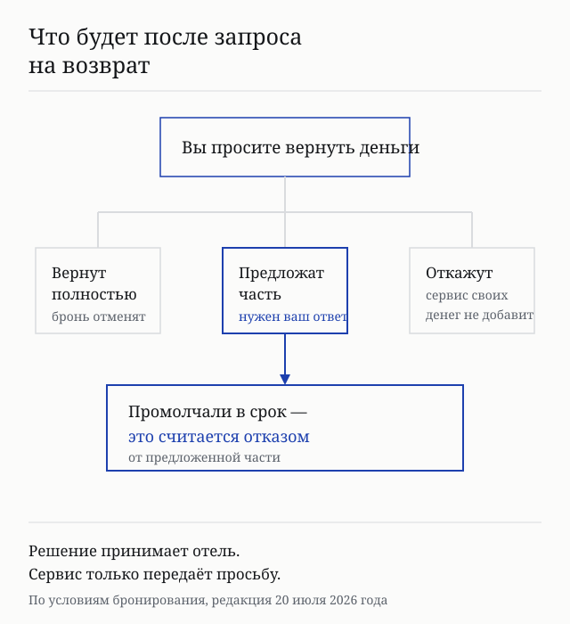
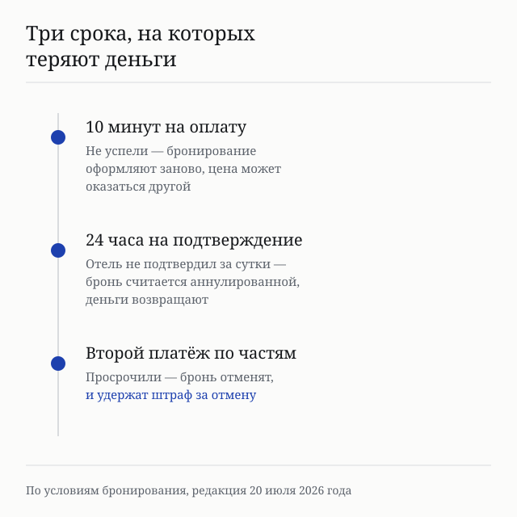

import AffiliateNote from '../../components/post/AffiliateNote.astro';
import { yandexTravelSub } from '../../data/affiliate.js';

Когда бронь через Яндекс Путешествия срывается, люди идут в поддержку сервиса и удивляются ответу. Причина в том, что сервис по своим же условиям не решает вопрос о возврате — он передаёт вашу просьбу отелю и ждёт его решения.

Я прочитал три документа сервиса и выписал то, что меняет поведение: кто с кем в договоре, кто назначает удержание и на каких сроках деньги теряют чаще всего.

> **Если коротко:** договор при бронировании возникает **между вами и отелем** (или хозяином квартиры), сервис лишь уполномочен принимать деньги. **Условия отмены назначает отель или партнёр**, а не сервис — единой шкалы нет. Если отель удерживает деньги, запрос на возврат сервис **только передаёт**: решение за отелем, и своих средств сервис не добавляет. При частичном возврате **молчание в отведённый срок засчитывается как отказ** от предложения. За бронирование отелей сервис **платных услуг гостю не оказывает** — сбора сверх цены нет. Данные по документам в редакциях от **20 июля и 3 июня 2026 года**.

<AffiliateNote />

---

## Кто ваш контрагент и почему это меняет всё

В условиях бронирования сервис определяет себя как **владельца агрегатора информации об услугах** по закону о защите прав потребителей. Это не оборот речи, а правовой статус с ограниченным набором обязанностей.

Дальше сказано прямо: при бронировании вы вступаете в прямые договорные отношения с исполнителем — отелем, санаторием или хозяином квартиры, а также с партнёром в части оформления брони. Сервис уполномочен принимать деньги в счёт оплаты, но **все права и обязанности по договору возникают у вас и у исполнителя**.

Отсюда практическое следствие: претензии по проживанию и по отказу от него направляются исполнителю или партнёру, данные которого показаны при бронировании и в подтверждении. К самому сервису адресуются только вопросы работы сайта — и, что заметно, письменно на бумаге по московскому адресу.

## Кто назначает удержание при отмене

Не сервис. Условия отмены и возврата стоимости проживания устанавливает партнёр или исполнитель и доводит до вас при бронировании.

Это тот же механизм, что у других площадок посуточной аренды: единой шкалы удержаний не существует, у каждого объекта своя, и увидеть её нужно до оплаты. Отдельная деталь — изменения условий сервиса **не распространяются на совершённые бронирования**, так что правила фиксируются на момент вашей брони.

<a href={yandexTravelSub('yandex_travel_2026')} class="aff-cta" rel="sponsored">Посмотреть отели и условия отмены</a> — условия отмены показаны в карточке до оплаты, есть фильтр по бесплатной отмене.

## Что происходит, когда вы просите деньги назад

Самый важный пункт всего документа, и он появился в редакции этого года.

Если отель установил условия с удержанием, вы можете через интерфейс отправить запрос на возврат или на уменьшение удерживаемой суммы. Дальше дословно: сервис выступает **исключительно информационным посредником**, передающим запрос отелю, **не принимает решений о возврате и не гарантирует их положительный результат**. Окончательное решение — за отелем, и сервис **не компенсирует деньги за счёт собственных средств**.

И ловушка, которую стоит запомнить отдельно. При **частичном** возврате деньги вернут только при вашем явном согласии с предложенными условиями, подтверждённом в срок, указанный в интерфейсе. **Неподтверждение в срок считается отказом** от предложения. То есть промолчать здесь — это не «подумать», а потерять предложенную часть.

Симметрично работает и обратное: если отель не ответил в указанный срок, молчание согласием не считается.

## Три срока, на которых теряют деньги

**Десять минут на оплату.** Сессия оплаты ограничена десятью минутами, если в интерфейсе не указано больше. По истечении процедуру бронирования проходят заново — а цена к тому моменту может стать другой.

**Сутки на подтверждение.** После оплаты данные уходят партнёру или отелю, и они подтверждают бронь в течение 24 часов. Не подтвердили — бронирование считается аннулированным, а стоимость проживания возвращается. Это защищает от зависшей брони, но означает, что до подтверждения поездка не гарантирована.

**Второй платёж при оплате по частям.** Когда доступна оплата частями, вторая часть вносится к сроку, установленному сервисом. Не поступила вовремя — бронь отменяют и возвращают деньги **за вычетом сумм за отмену**, установленных партнёром или отелем. Просрочка превращается в платную отмену.

## Что сервис не берёт и что не входит в цену

В разделе отелей сервис **не оказывает гостю платных услуг**, в том числе при бронировании через его систему. Отдельного сервисного сбора поверх цены нет — сравнивать предложения можно по показанной сумме.

Но два начисления в эту сумму не входят.

**Курортный сбор.** Стоимость размещения его не включает, а информация о нём на сайте носит справочный характер. Платить его придётся на месте.

**Разница по курсу при иностранной карте.** Если платить картой иностранного банка или картой со счётом в другой валюте, сумма списания конвертируется банком, и при возврате сумма может отличаться от первоначальной из-за курса и комиссий. Сервис **не гарантирует компенсацию курсовой разницы** — расходы на конвертацию несёт плательщик.

Отдельно стоит знать про значки в карточках. Пометка «Дешевле на Х ₽» сравнивает текущую цену со средней ценой на этот объект за предыдущие два месяца по запросам пользователей с таким же сроком и горизонтом планирования. Это не скидка от отеля, а сопоставление со своей же историей. Пометки «Рекомендуем», «Можно доверять» и «Суперхозяин» сервис сопровождает оговоркой, что они носят справочный характер и заверениями или гарантиями не являются.

## Кому Яндекс Путешествия не подходят

Список составлен по документам сервиса, а не по отзывам.

**Тем, кому важна единая понятная отмена.** Условия назначает каждый отель отдельно, и сравнивать их приходится вручную по карточкам.

**Тем, кто рассчитывает на защиту сервиса в споре о деньгах.** По условиям сервис не принимает решений о возврате и не добавляет своих средств. Спор идёт с отелем.

**Тем, кто бронирует квартиру у частного лица.** Условия обязывают гостя **самостоятельно запросить у исполнителя документы**, подтверждающие право сдавать объект, и проверить их. За последствия того, что этого не сделали, сервис ответственности не несёт.

**Тем, кто платит зарубежной картой.** Возврат приходит с курсовой разницей, и компенсировать её никто не обещает.

**Тем, кто ждёт кэшбэк по умолчанию.** Баллы Плюса начисляются **исключительно если об этом сказано в интерфейсе при оформлении** конкретной брони, а не за каждую покупку.

## Что за компания и кто ещё участвует

Сервис принадлежит **ООО «Яндекс.Вертикали»**, ОГРН 5157746192742, адрес: Москва, улица Садовническая, дом 82, строение 2. Под сервисом работают три раздела на отдельных адресах: отели, авиабилеты и железнодорожные билеты.

Важная деталь для понимания ответственности: **бронирование не всегда идёт напрямую**. В условиях названы два партнёра, через которых оформляются брони: **ООО «Компания Броневик»** (ОГРН 1046603999738, Екатеринбург) и **ООО «БСР»** (ОГРН 1177746724540, Москва). Конкретный партнёр показывается при оформлении, и именно ему адресуются вопросы по брони.

Разделы устроены по-разному. Авиабилеты оформляются и оплачиваются **на сайтах партнёров**, туры в сервисе предоставляет **ООО «Академия Сервиса»**. То есть «Яндекс Путешествия» — это витрина над несколькими разными продавцами, и от того, что вы бронируете, зависит, с кем у вас договор.

<a href={yandexTravelSub('yandex_travel_2026_final')} class="aff-cta" rel="sponsored">Подобрать отель с бесплатной отменой</a> — в карточке видно исполнителя, условия отмены и начисление баллов до оплаты.

