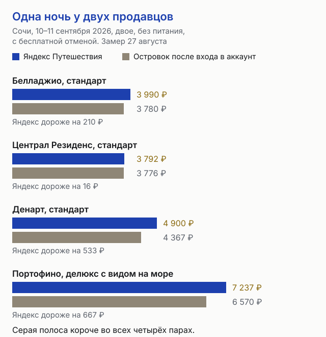
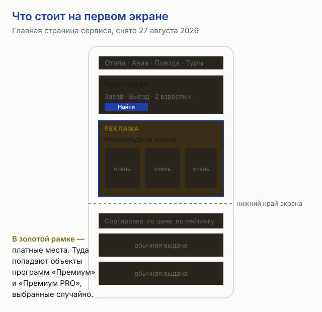
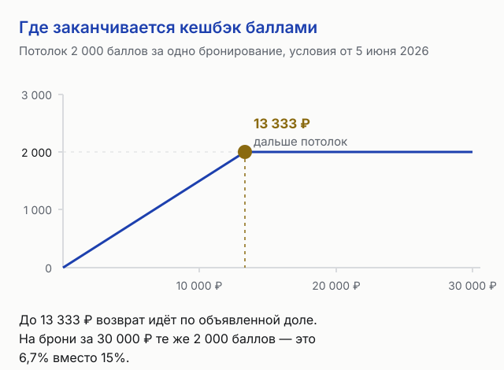
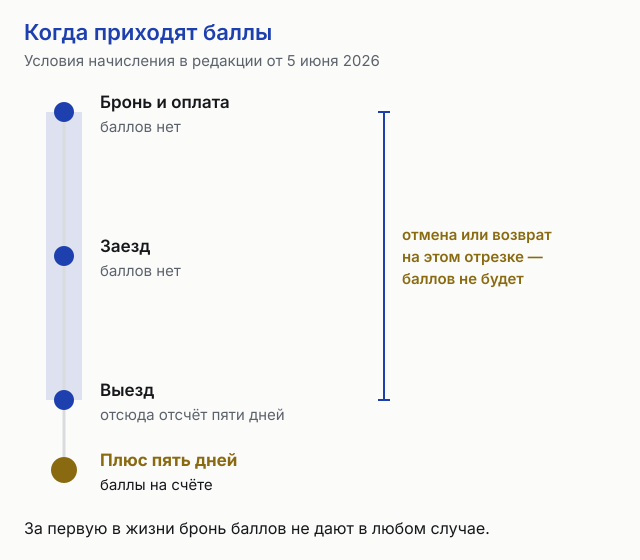

import AffiliateNote from '../../components/post/AffiliateNote.astro';
import { yandexTravelSub, ostrovokCity } from '../../data/affiliate.js';

На главной странице сервиса написано, что номер вы забронируете «без комиссии и без переплаты». Для гостя это правда: отдельной строки за услуги сервиса при бронировании отеля в счёте нет. Комиссию платит объект размещения — **17% цены брони, а за участие в программах продвижения 20% и 25%**, и эти доли объявлены самим сервисом 16 декабря 2025 года.

Дальше — про то, во что это выливается на витрине. Я сравнил восемь одинаковых номеров в Сочи на ночь 10 сентября 2026 года у двух продавцов подряд: на открытых ценах Яндекс дешевле Островка на семи строках из восьми, а на цене Островка для вошедшего в аккаунт — дороже на всех восьми.

> **Если коротко:** гость за бронирование отеля сервису не платит, **17–25% удерживают с объекта**. Открытая цена у Яндекса чаще ниже, чем у Островка, но **вход в аккаунт конкурента переворачивает сравнение на всех восьми замеренных строках**. Зачёркнутая цена на витрине Яндекса — это не «цена до скидки вообще», а тот же тариф объекта, что и открытая цена соседней площадки. Кешбэк баллами ограничен **потолком в 2 000 баллов** за бронирование, **за первую бронь баллов не дают**, а без подписки Плюс их не начисляют и не позволяют списать. На билетах правило другое: там **сбор сервиса включён в цену**, размер его не назван, и при возврате он не возвращается.

<AffiliateNote />

## Кто и сколько платит сервису за бронирование отеля

Обновлённые условия сотрудничества сервис объявил 16 декабря 2025 года, в силу они вступили 1 февраля 2026-го. Базовая комиссия за успешное бронирование — **17%, включая НДС**. Она берётся не только с оплаченного проживания, но и со штрафов, которые сервис удержал с гостя при отмене.

Отдельная ставка — за продвижение. Объект, подключённый к программе «Премиум», отдаёт **20%**, к «Премиум PRO» — **25%**. Для корпоративных тарифов комиссия поднялась с 18 до 20%, а минимальная скидка от объекта в таких тарифах осталась на уровне 5%.

Причину повышения сервис назвал сам: инвестиции в развитие на фоне роста аудитории. Для читателя отсюда следует одно практическое правило: **разница между 17% и 25% сидит в той же цене, которую видите вы**, и объект, купивший продвижение, либо зарабатывает меньше с ночи, либо ставит цену выше. Проверить, в какой программе конкретный отель, из карточки нельзя.

<a href={yandexTravelSub('yandex_hub_2026')} class="aff-cta" rel="sponsored">Посмотреть цены и условия отмены на свои даты</a> — условия отмены и питание видны в карточке до оплаты, оплата картой российского банка.

## Одна и та же ночь у двух продавцов: замер 27 августа 2026

Сравнивать «от» с «от» нечестно: у гостиницы в один день несколько категорий и несколько тарифов, и площадки показывают минимум из разных наборов. Поэтому в таблицу вошли только строки, где совпало всё: гостиница, категория номера, дата, число гостей, питание и тип отмены. Условия одинаковые везде — **одна ночь с 10 на 11 сентября 2026 года, двое взрослых, один номер, без питания, с бесплатной отменой, цена за всю ночь со всеми налогами**. Цены сняты 27 августа.

| Гостиница в Сочи | Номер | Яндекс Путешествия | Островок, открытая цена | Островок после входа |
|---|---|---|---|---|
| Белладжио, Виноградная 184/2 | Стандарт | **3 990 ₽** | 4 200 ₽ | 3 780 ₽ |
| Белладжио | Комфорт | **4 275 ₽** | 4 500 ₽ | 4 050 ₽ |
| Белладжио | Стандарт с балконом | **4 370 ₽** | 4 600 ₽ | 4 140 ₽ |
| Централ Резиденс, Северная 10 | Стандарт | **3 792 ₽** | 4 243 ₽ | 3 776 ₽ |
| Централ Резиденс | Студия без окна | **3 792 ₽** | 4 243 ₽ | 3 776 ₽ |
| Централ Резиденс | Комфорт | **3 889 ₽** | 4 352 ₽ | 3 873 ₽ |
| Денарт, переулок Горького 16 | Стандарт | 4 900 ₽ | **4 852 ₽** | 4 367 ₽ |
| Портофино, Приморская 3/14 | Делюкс с видом на море | **7 237 ₽** | 7 300 ₽ | 6 570 ₽ |

По открытым ценам Яндекс оказался дешевле на семи строках из восьми: от 0,9% на люксовом номере Портофино до 10,6% в Централ Резиденс. Восьмая строка перевернулась — стандарт в Денарте стоил 4 852 ₽ на Островке против 4 900 ₽ у Яндекса, разница в 48 ₽.

Третья колонка меняет вывод целиком. Островок показывает вошедшему в аккаунт цену ниже открытой — на замеренных гостиницах скидка составила от 10 до 11%. С ней **дешевле оказался Островок на всех восьми строках**: на 0,4% в Централ Резиденс, на 5,3% в Белладжио, на 9,2% в Портофино и на 10,9% в Денарте.

Вывод для практики: **сравнение двух витрин без учёта аккаунта ничего не решает**. Разрыв между площадками на этих номерах не превышает 11% в обе стороны, и знак разницы зависит от того, вошли ли вы, а не от того, кто «дешевле вообще».

Обе площадки из таблицы — наши партнёры, и на числа это не повлияло: они сняты с витрин подряд в один час, а по третьей колонке дешевле оказался не тот сервис, про который статья. Если бронируете с аккаунтом, честнее <a href={ostrovokCity('russia', 'sochi', 'yandex_hub_compare_2026')} class="aff-cta" rel="sponsored">проверить те же даты на Островке</a> — цену для вошедших он показывает до оплаты.

## Почему зачёркнутая цена совпала с ценой конкурента

В карточке Белладжио у каждого номера стоит скидка −5% и зачёркнутая цена. Я выписал зачёркнутые числа по пяти категориям и сравнил с открытой ценой той же категории на Островке:

| Номер | Зачёркнуто на Яндексе | Открытая цена Островка |
|---|---|---|
| Стандарт | 4 200 ₽ | 4 200 ₽ |
| Комфорт | 4 500 ₽ | 4 500 ₽ |
| Стандарт с балконом | 4 600 ₽ | 4 600 ₽ |
| Люкс | 4 700 ₽ | — |
| ДеЛюкс | 4 800 ₽ | — |

Совпадение до рубля на всех трёх строках, где обе площадки показали один и тот же номер. Значит зачёркнутая цифра — **не выдуманный «старый ценник», а действующий тариф гостиницы**, тот самый, что стоит у соседей. Скидку сверху даёт площадка, а не объект, и на витрине она выглядит как уценка.

Это же объясняет, почему на разных гостиницах разрыв разный: у Белладжио скидка Яндекса −5%, у Централ Резиденс — около −10,6%, у Портофино её нет вовсе. Практический смысл — **зачёркнутое число читать как ориентир базового тарифа**, а не как чью-то щедрость.

## Первый экран — это платные места

На главной странице сервиса первым идёт блок «Рекомендуем жильё» с подборкой гостиниц. Над ним стоит пометка «Реклама» — сервис своё место называет прямо, но объяснения, кто в подборку попадает, рядом нет.

Оно есть в условиях для отельеров. С 1 февраля 2026 года объекты программ «Премиум» и «Премиум PRO» получают приоритетный показ в блоке «Жильё рядом» внутри карточек, отдельную подборку «Мы рекомендуем» на первом экране и показ в результатах поиска авиа- и ж/д билетов. Дальше сказано главное: **мест в этих блоках ограниченное число, и объекты для них выбираются случайным образом** из числа участников платных программ. Состав подборки у разных пользователей отличается.

То есть верх экрана отвечает на вопрос «кто заплатил за показ», а не «что здесь лучшее по цене или отзывам». Обход один: **переключить сортировку на цену или рейтинг и не читать первые карточки как рекомендацию.**

## Кешбэк баллами: где заканчиваются 15%

На карточке поиска сервис обещает кешбэк баллами Плюса — 27 августа 2026 года на панели карты стояла строка «до 15%». Условия начисления в редакции от 5 июня 2026 года ограничивают это обещание четырьмя способами сразу.

**Потолок.** За одно завершённое бронирование начисляют **не больше 2 000 баллов**. При объявленных 15% потолок срабатывает на брони дороже 13 333 ₽: дальше доля возврата падает, и на счёте за 30 000 ₽ те же 2 000 баллов дают 6,7%.

**Первая бронь.** По пункту 3.2.1 за первое завершённое бронирование баллы не начисляют, если в интерфейсе не написано иное. Уровень «Новичок» присваивается при отсутствии броней; первый уровень открывается с первой оплаченной поездки, второй — с пятой, третий — с пятнадцатой, и в счёт идут только брони от 1 000 ₽.

**Подписка.** Без действующей подписки Яндекс Плюс баллы за бронирование не начисляют и списать их на сервисе не дают. Уровень при этом расти может, а деньги — нет.

**Срок и условия отмены.** Баллы приходят **в течение пяти дней после выезда**, а не после оплаты. Отменённая бронь и бронь с возвратом денег завершённой не считаются — начисления по ним не будет. При оплате промокодом баллы могут не начислить вовсе; предупреждение об этом сервис показывает при оформлении.

## Билеты на поезд и самолёт: сбор есть, размера нет

С билетами схема обратная той, что с отелями. Справка сервиса перечисляет состав цены ж/д билета прямым списком: стоимость проезда и плацкарты, которую устанавливает ОАО «РЖД», **плюс сервисный сбор Яндекса**. Размер сбора не назван ни в справке, ни на витрине.

Увидеть его можно сравнением с ценой перевозчика. По замеру 26 августа 2026 года на семи местах двух маршрутов надбавка Яндекса над ценой ОАО «РЖД» держалась на 13,0–13,5% в плацкарте и поднималась до 23–25% на сидячем месте и в СВ — числа и таблица в [разборе цен Туту.ру и Яндекс Путешествий на одних и тех же поездах](/blog/tutu-ru-2026/).

Что важно знать до покупки:

- при возврате билета **сервисные сборы Яндекса и перевозчика не возвращаются**, как и плата за услугу «Оплатить потом»;
- на поездах дальнего зарубежья не возвращается ещё и стоимость плацкарты;
- поменять дату или время онлайн нельзя — билет возвращают и покупают заново;
- за переоформление берут сбор, установленный Федеральной антимонопольной службой, — **252 рубля 20 копеек**;
- вернуть билет онлайн можно до отправления поезда, пригородный — не позднее чем за час; позже только в кассе;
- если поезд отменили, задержали или не дали место из билета, возвращают полную стоимость и сбор за возврат не берут.

На авиабилетах размер сбора определяет продавец, и у каждого агентства он свой — как это выглядит на одном рейсе у восьми продавцов, показано в разборе [сборов и цен на Авиасейлсе](/blog/aviasales-2026/). Частный сектор и квартиры живут на другой площадке, там своя плата хозяину — [что удерживает Суточно.ру](/blog/sutochno-ru-2026/).

## Если бронь сорвалась, решает отель

По условиям бронирования договор на проживание возникает между гостем и объектом размещения, а сервис выступает владельцем агрегатора и уполномочен принимать оплату. Условия отмены назначает объект или партнёр, единой шкалы удержаний нет, а запрос на возврат сервис передаёт и ждёт решения отеля.

Отдельный разбор этой части — со сроками, с пунктом про молчание гостя при частичном возврате и с тем, кому направлять претензию, — в статье [«Яндекс Путешествия: отмена брони и возврат денег»](/blog/yandex-puteshestviya-2026/).

## Кому Яндекс Путешествия не подходят

- **Тем, кто ищет один нижний ценник.** Разрыв с соседней площадкой на замеренных номерах ходил в обе стороны и менялся от входа в аккаунт. Одна витрина вопрос не закрывает.
- **Тем, у кого нет подписки Плюс.** Главный аргумент сервиса — кешбэк баллами; без подписки его нет, и остаётся обычная витрина.
- **Тем, кто бронирует дорого и редко.** Потолок 2 000 баллов бьёт по дорогим броням, а за первую поездку баллов не дают вовсе.
- **Тем, кому нужен разговор с отелем до оплаты.** Обращения идут через форму бронирования, а часть из них условия принимают только в письменном виде на бумажном носителе.
- **Тем, кто часто меняет планы по билетам.** Обмена нет, сбор при возврате остаётся у продавца.

Дальнего зарубежья это тоже касается: у сервиса сильный российский набор объектов, и сравнивать его с зарубежными площадками стоит по конкретному городу, а не по названию.

## Как бронировать и не переплатить: порядок

1. **Снять цену на своих датах у двух-трёх продавцов подряд**, а не по памяти: тарифы объекта меняются в течение дня.
2. **Сравнивать одинаковое** — категорию номера, питание и тип отмены. Стандарт без питания против студии с завтраком сравнением не считается.
3. **Проверить, что даёт вход в аккаунт** у каждой площадки: в замере это переворачивало результат.
4. **Считать баллы отдельно от цены.** Балл начисляют после выезда, он равен рублю и упирается в потолок 2 000.
5. **Прочитать условия отмены в карточке до оплаты** — их пишет объект, и у соседних номеров они разные.
6. **На билетах смотреть цену перевозчика.** Сбор сервиса в цену включён, отдельной строкой его не покажут.

<a href={yandexTravelSub('yandex_hub_final_2026')} class="aff-cta" rel="sponsored">Проверить свои даты и сравнить условия отмены</a> — фильтр по бесплатной отмене, кешбэк баллами при действующей подписке Плюс.

## FAQ — частые вопросы про Яндекс Путешествия

**Берёт ли Яндекс Путешествия комиссию с гостя за отель?**
Отдельной строкой за бронирование отеля гостю не выставляют ничего — сервис пишет об этом на главной странице. Комиссию платит объект размещения: 17% цены брони с 1 февраля 2026 года, 20% для участников программы «Премиум» и 25% для «Премиум PRO».

**Где дешевле — на Яндексе или на Островке?**
Зависит от аккаунта. По замеру 27 августа 2026 года на восьми одинаковых номерах в Сочи открытая цена Яндекса была ниже на семи строках из восьми, до 10,6%. Но цена Островка для вошедшего в аккаунт оказалась ниже цены Яндекса на всех восьми строках, до 10,9%.

**Что значит зачёркнутая цена в карточке?**
Действующий тариф объекта. На пяти категориях гостиницы Белладжио зачёркнутые числа совпали с открытой ценой той же категории на другой площадке до рубля, а скидку сверху давала сама витрина.

**Сколько баллов реально вернётся за бронирование?**
Не больше 2 000 за одну бронь — это прямой потолок из условий начисления в редакции от 5 июня 2026 года. За первое завершённое бронирование баллы не начисляют, если в интерфейсе не сказано иное, а без действующей подписки Яндекс Плюс их не начисляют и не дают списать.

**Когда приходят баллы?**
В течение пяти дней после выезда из объекта. Бронь, которую отменили или по которой вернули деньги, завершённой не считается, и баллов по ней не будет.

**Есть ли сервисный сбор на билетах?**
Есть. Справка сервиса прямо называет его частью цены ж/д билета наравне со стоимостью проезда и плацкарты. Размер не публикуется, а при возврате билета сбор не возвращается.

**Кому предъявлять претензию, если отель не заселил?**
Объекту размещения или партнёру, оформившему бронь: договор на проживание заключается с ними, а сервис по условиям бронирования выступает владельцем агрегатора и уполномочен принимать оплату.

**Кто такой Яндекс Путешествия юридически?**
ООО «Яндекс.Вертикали», ОГРН 5157746192742, адрес: 115035, Москва, улица Садовническая, дом 82, строение 2, помещение 3А06. Реквизиты названы в условиях начисления баллов и в условиях сотрудничества с объектами размещения.

*Фото: ООО «АЗИМУТ Хотелс Компани» / Wikimedia Commons / [CC BY-SA](https://creativecommons.org/licenses/by-sa/4.0/). Схема первого экрана, полосы цен, линия сроков начисления и график потолка баллов наши, построены на данных этой статьи. Цены восьми номеров сняты 27 августа 2026 года у двух продавцов подряд и меняются в течение дня; условия сервиса — по документам в редакциях от 16 декабря 2025 и 5 июня 2026 года. Материал описывает правила сервиса и не заменяет юридическую консультацию.*
