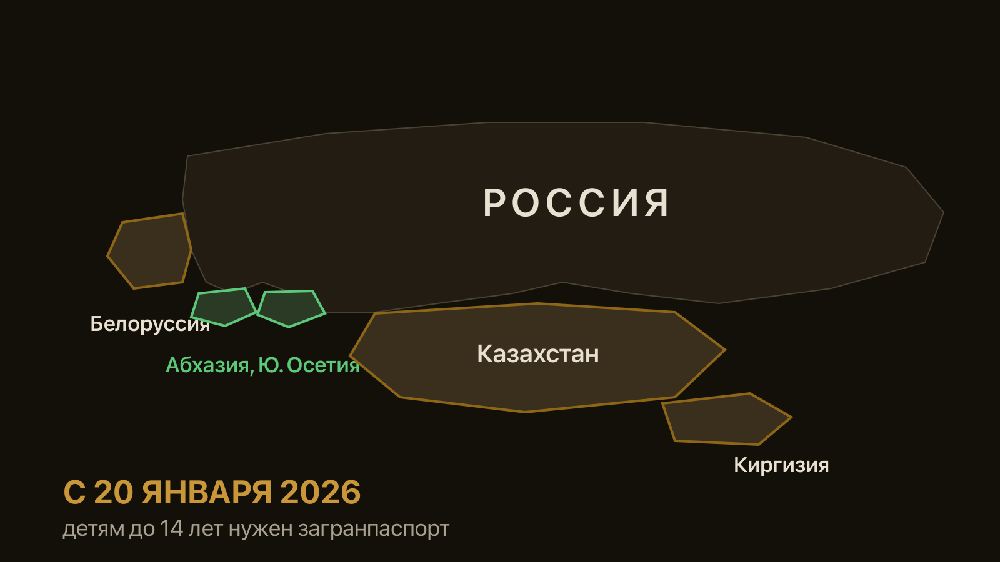

import AffiliateNote from '../../components/post/AffiliateNote.astro';
import { cherehapaTravel } from '../../data/affiliate.js';

Родители узнают об этом на границе. Ребёнок много лет ездил в Абхазию и Казахстан по свидетельству о рождении, а с зимы 2026 года этот документ на выезде не принимают — и семья разворачивается в аэропорту.

> **Если коротко:** с **20 января 2026 года** свидетельство о рождении исключено из документов, по которым ребёнок до 14 лет выезжает из России. Теперь нужен **загранпаспорт** — свой или запись в паспорте родителя старого образца. **Исключение осталось только для Абхазии и Южной Осетии**: туда пограничная служба пропускает детей по свидетельству с отметкой о гражданстве, и это разрешение действует **до конца 2027 года**.

<AffiliateNote />

---

## Что изменилось с 20 января 2026 года?

Свидетельство о рождении перестало быть документом, по которому ребёнок пересекает границу. Норму ввёл [Федеральный закон от 23 июля 2025 года № 257-ФЗ](https://base.garant.ru/412378458/): из перечня документов для выезда из России и въезда в неё убрали свидетельство о рождении для граждан младше 14 лет.

До этой даты свидетельство работало не везде, а только там, где с Россией нет визового режима и погранконтроль принимает внутренние документы: Абхазия, Белоруссия, Казахстан, Киргизия, Южная Осетия. Во все остальные страны загранпаспорт ребёнку требовался и раньше.

**Обратно в Россию по свидетельству пустят.** Это прописано в самом законе: ребёнок, который выехал по свидетельству и не имеет паспорта, вправе вернуться домой по нему же. Норма страхует тех, кто уехал до 20 января и застрял за границей без документов.

Формулировка закона касается **выезда из России**, а не въезда в конкретную страну. Разница кажется юридической мелочью, но именно она рождает большую часть путаницы, и разбирается она в следующем разделе.

### Кого изменение не касается вовсе

Подростков с 14 лет: у них есть внутренний паспорт, и правила для них не менялись. Поездок внутри России — Крым, Калининград, Дагестан и любой другой регион требуют только свидетельства о рождении, и то по правилам перевозчика, а не пограничников. Детей с действующим загранпаспортом: он работает весь свой срок, переоформлять из-за нового закона ничего не нужно.

**Опекунов и приёмные семьи** правила касаются наравне с родителями: заявление подаёт законный представитель, и к обычному пакету добавляется документ, подтверждающий его полномочия.

**Отдельный случай — двойное гражданство.** Если у ребёнка есть паспорт другой страны, выезжать из России он обязан по российскому документу. Второй паспорт предъявляют на въезде в ту страну, гражданином которой ребёнок является.

---

## Куда ребёнку нужен загранпаспорт, а куда нет?

| Куда едете | Документ ребёнку до 14 лет |
|---|---|
| Белоруссия | загранпаспорт |
| Казахстан | загранпаспорт |
| Киргизия | загранпаспорт |
| **Абхазия** | **свидетельство о рождении** с отметкой о гражданстве — до конца 2027 |
| **Южная Осетия** | **свидетельство о рождении** с отметкой о гражданстве — до конца 2027 |
| Турция, Египет, ОАЭ, Таиланд и другие | загранпаспорт, как и раньше |
| Поездки внутри России | никаких заграничных документов |

По Армении правила отличаются в деталях, и они разобраны отдельно: [загранпаспорт в Армению россиянам](/blog/armenia-zagranpasport-2026/).

**Про визовые страны отдельно.** Для Турции, Египта, ОАЭ, Таиланда и остальных направлений с визой или без неё загранпаспорт ребёнку требовался и до 2026 года — там изменение ничего не поменяло. Новость касается ровно пяти соседних стран, куда раньше пускали по внутренним документам.

**Транзит тоже считается.** Если летите с пересадкой в третьей стране, документы должны годиться и для неё: при смене аэропорта или выходе в город нужна виза, если она для этой страны требуется.

Строки про Абхазию и Южную Осетию требуют пояснения, потому что они противоречат первым трём.

### Почему Абхазия осталась исключением

Закон убрал свидетельство из документов для выезда, а через два с половиной месяца по Абхазии и Южной Осетии сделали отдельное исключение. Решение принял президент 2 апреля 2026 года, объявили о нём на следующий день на Абхазском международном экономическом форуме, а МИД выпустил разъяснение 7 мая. Смысл: **детей до 14 лет продолжают пропускать по свидетельству о рождении**, если в нём стоит отметка о российском гражданстве. Порядок временный, срок назван прямо — **до конца 2027 года**.

Именно этой оговорки нет в большинстве разборов. Их авторы прочитали текст закона, увидели в списке Абхазию и написали, что загранпаспорт теперь обязателен. Формально закон это и говорит, а на границе Псоу работает исключение.

**Ситуация менялась дважды за три месяца, и это стоит перепроверять.** С 20 января свидетельство перестали принимать, в апреле исключение вернули, разъяснение МИД вышло только в мае — туроператоры всё это время получали противоречивые ответы. Перед поездкой имеет смысл заглянуть на страницу консульского департамента МИД: там публикуют действующий порядок по каждой стране, и это первоисточник, а не пересказ.

**Что это значит для родителя.** Если едете в Абхазию этим летом или в 2027 году, паспорт ребёнку делать не обязательно — хватит свидетельства с красным штампом о гражданстве. Если едете куда-то ещё, включая Белоруссию, паспорт нужен. Полный разбор абхазских правил, включая документы для взрослых и порядок на границе Псоу, — в статье [нужен ли загранпаспорт в Абхазию](/blog/zagranpasport-v-abhaziyu-2026/).

### Как выглядит отметка о гражданстве

Это штамп на обороте свидетельства о рождении. У документов, выданных с 2007 года, гражданство подтверждается сведениями о родителях-гражданах России прямо в свидетельстве, и отдельный штамп не нужен — но пограничник смотрит на конкретный бланк, а не на год. Спорить на границе бесполезно, поэтому штамп проще поставить.

**Где ставят.** В подразделении МВД по вопросам миграции по месту жительства, бесплатно, обычно за один визит. Нужны свидетельство о рождении ребёнка и паспорта родителей.

**Отметку о гражданстве проверьте заранее.** Её ставят в подразделении МВД по вопросам миграции, обычно за один визит. Без штампа свидетельство на границе не примут даже в Абхазии.

---

## Какой паспорт делать: на 5 лет, на 10 или запись в родительском?

У родителя ребёнка до 14 лет три варианта, и они не равноценны.

**Паспорт старого образца на 5 лет.** Государственная пошлина — **1 000 ₽**. Фотография вклеивается обычным способом, биометрию сдавать не нужно, ребёнка не надо везти на съёмку в подразделение МВД.

**Биометрический паспорт на 10 лет.** Пошлина — **3 000 ₽**. Ребёнка придётся привезти лично: фотографируют на месте. Отпечатки пальцев берут только с 12 лет.

**Запись в загранпаспорте родителя.** Пошлина — **500 ₽**, дешевле всего. Но у варианта два жёстких ограничения: вписать ребёнка можно **только в паспорт старого образца** (в биометрический — нельзя), и ребёнок сможет выезжать **только вместе с этим родителем**. Поездка с бабушкой, со вторым родителем без записи или в детской группе по такой записи невозможна.

### Как оформляют и что готовят заранее

Заявление подают через Госуслуги, в МФЦ или в подразделении МВД по вопросам миграции. От родителя нужен его паспорт, свидетельство о рождении ребёнка, документ об опеке — если он есть, — и квитанция об оплате пошлины. Отдельного согласия второго родителя на само оформление паспорта не требуется.

**Фотография.** Для паспорта старого образца снимок приносят с собой, требования обычные: без головного убора, лицо занимает большую часть кадра. С младенцами это отдельная задача: снимать приходится лёжа на однотонной ткани, потому что удержать голову ребёнок ещё не может. Для биометрического паспорта фотографируют на месте, приносить ничего не нужно.

**Отпечатки пальцев** берут только с 12 лет. До этого возраста биометрический паспорт оформляют без них.

**Заявление через Госуслуги удобнее только наполовину.** Подать документы онлайн можно, но за фотографированием и за готовым паспортом всё равно нужно прийти лично, а свободное время для визита система предлагает не всегда на ближайшие дни.

**Готовый паспорт получает родитель**, привозить ребёнка при выдаче не нужно — кроме случаев, когда подразделение просит подтвердить личность.

### Как выбрать

Детям до 7 лет обычно берут паспорт на пять лет: внешность в этом возрасте меняется быстро, и на десятилетнем документе четырёхлетний ребёнок к школе становится неузнаваемым, что даёт лишние вопросы на паспортном контроле. Если ребёнок постарше и поездок много, десятилетний биометрический выходит выгоднее по деньгам за год.

---

## Сколько стоит и сколько ждать?

| Что оформляем | Пошлина | Срок действия |
|---|---|---|
| паспорт старого образца ребёнку до 14 | 1 000 ₽ | 5 лет |
| биометрический паспорт ребёнку до 14 | 3 000 ₽ | 10 лет |
| запись о ребёнке в паспорт родителя | 500 ₽ | до 14 лет ребёнка |

Суммы установлены статьёй 333.28 Налогового кодекса. Повышение пошлин 26 июля 2026 года паспортов российских граждан не коснулось — оно затронуло платежи по вопросам гражданства и миграции, это проверено отдельно.

**Срок изготовления — от одного до трёх месяцев.** По месту постоянной регистрации обычно быстрее, при подаче в другом регионе дольше. Заявление подаёт законный представитель: родитель, усыновитель, опекун. Подать можно через Госуслуги, в МФЦ или в подразделении МВД по вопросам миграции.

**Считайте от даты вылета, а не от даты подачи.** Между решением оформить паспорт и подачей заявления часто проходит ещё несколько недель: запись в МФЦ бывает занята, а фотографию младенца получается сделать не с первой попытки.

**Практический вывод про сроки.** Если поездка запланирована на новогодние каникулы, подавать заявление нужно не позже начала октября. Между «подал» и «получил» может встать месяц ожидания записи на подачу, и это время в официальный срок не входит.

---

## Нужно ли согласие второго родителя?

Нет, если ребёнок едет с одним из родителей. Нотариальное согласие второго не требуется — не важно, в браке родители или в разводе. Это самое живучее заблуждение в теме.

**Одно исключение делает всю разницу.** Второй родитель вправе подать заявление о несогласии на выезд ребёнка. После этого пограничники не выпустят ребёнка ни с кем, включая того родителя, с которым он живёт, и снять запрет можно только через суд.

**Проверить, не подан ли запрет, можно заранее.** Информацию о действующем несогласии выдают в подразделении МВД по вопросам миграции по заявлению родителя. Если отношения со вторым родителем напряжённые, а поездка дорогая, проверку лучше сделать до покупки билетов, а не на стойке регистрации.

### Если запрет подан

Снять его добровольно вправе только тот родитель, который подал: он пишет заявление об отзыве в том же подразделении МВД. Если договориться не выходит, вопрос решается судом, и на это уходят месяцы. Готовых сроков тут нет: суд смотрит на цель поездки, её длительность и на то, не пытается ли один родитель вывезти ребёнка насовсем.

**Запрет не отменяет поездок внутри России** — он касается только выезда за границу.

**Отдельная история — виза.** Согласие второго родителя не нужно российской границе, но может потребоваться консульству страны въезда: чаще всего этого просят при оформлении шенгенской визы. Требования смотрите на сайте конкретного консульства, они различаются.

---

## Ребёнок едет без родителей и что взять на границу

Здесь согласие обязательно. Если ребёнка не сопровождает ни один из родителей, нужно **нотариальное согласие** на выезд от родителя или опекуна.

В согласии указывают срок поездки и государства, которые ребёнок посетит. Формулировка «страны Европы» не годится: страны перечисляют поимённо. Если маршрут с пересадкой в третьей стране, её тоже вписывают.

Сопровождающему стоит взять с собой копию свидетельства о рождении: она подтверждает родство, если фамилии у ребёнка и взрослого разные. Обязательным документом для выезда её не считают, но вопросы на контроле снимает.

**Медицинская страховка для ребёнка без родителей — не формальность.** В хороших полисах есть отдельная опция: если сопровождающий взрослый попадёт в больницу, страховая оплачивает возвращение ребёнка домой. Стоит она немного, а закрывает ровно тот сценарий, ради которого страховку и покупают.

<a class="aff-cta" href={cherehapaTravel('zagranpasport_rebenku_group')} rel="sponsored noopener" target="_blank">Подобрать полис с опцией возврата ребёнка домой</a> Cherehapa сравнивает предложения российских страховщиков, оплата картой РФ, полис приходит в PDF

### Что взять на границу, кроме паспорта

**Свидетельство о рождении — даже когда есть паспорт.** Оно подтверждает родство, если у ребёнка и родителя разные фамилии. Обязательным документом на выезде его больше не считают, но берут именно для этого.

**Отметку о гражданстве** — если едете в Абхазию или Южную Осетию по свидетельству. Без неё исключение не работает.

**Нотариальное согласие** — если ребёнок едет без родителей.

**Билеты и брони** — их спрашивают не пограничники, а сотрудники авиакомпании при регистрации: у части перевозчиков на детский тариф действуют свои правила подтверждения возраста.

**Полис для страны въезда.** Для шенгенской визы страховка входит в обязательный пакет документов, без неё визу не выдадут. В безвизовые страны её не спрашивают на границе, но медицина за границей платная, а детские обращения к врачу в поездке случаются чаще взрослых.

---

## Частые вопросы

**Ребёнку до года тоже нужен загранпаспорт?**
Да, правила не зависят от возраста внутри категории «до 14 лет». Младенца вписывают в паспорт родителя старого образца или делают ему свой документ.

**Свидетельство о рождении теперь бесполезно?**
Нет. По нему ребёнок вернётся в Россию, если выехал по свидетельству и своего паспорта не имеет. По нему же пускают в Абхазию и Южную Осетию до конца 2027 года. И оно подтверждает родство, если фамилии в семье разные.

**Можно ли вписать ребёнка в биометрический паспорт?**
Нет. Записи о детях вносят только в паспорта старого образца. Если у вас биометрический, ребёнку нужен собственный документ.

**Ребёнок вписан в мой паспорт — может он лететь с бабушкой?**
Нет. По записи ребёнок пересекает границу только вместе с тем родителем, в чей паспорт вписан. Для поездки с любым другим взрослым нужен свой паспорт ребёнка.

**Сколько действует паспорт ребёнка, если он вырос?**
Документ действует весь свой срок независимо от того, как изменилась внешность. Но если ребёнка перестают узнавать по фотографии, паспорт лучше поменять досрочно: решение о пропуске принимает офицер на контроле.

**Ребёнок родился за границей — что с документами?**
Если у ребёнка есть российское свидетельство о рождении, оформленное консульством, порядок обычный. Если свидетельство выдано местными властями другой страны, его сначала легализуют или проставляют апостиль, а затем переводят и заверяют перевод. Это добавляет к сроку ещё несколько недель, и закладывать их нужно заранее.

**Паспорт ребёнка потерялся в поездке — как вернуться?**
Через консульство России в стране пребывания: там оформляют свидетельство на возвращение. Документ разовый, действует до 15 дней и годится только для въезда в Россию. Для его получения нужны фотографии ребёнка и любые документы, подтверждающие личность, поэтому копия свидетельства о рождении в телефоне выручает.

**Годится ли загранпаспорт со старым сроком действия?**
Для выезда из России паспорт должен быть действителен на дату пересечения границы. А вот принимающая страна часто требует запас: у большинства безвизовых направлений это три или шесть месяцев после даты возвращения. Правило распространяется и на детские паспорта.

**Нужен ли ребёнку отдельный полис или хватит семейного?**
Полис оформляется на каждого путешественника поимённо, но покупается одним документом на семью. Отдельно считать не придётся, а вот вписать ребёнка в заявку нужно: при страховом случае платят только по тем, кто в полисе указан.

**Что делать, если поездка через месяц, а паспорта нет?**
Ускоренное оформление возможно при подтверждённых обстоятельствах: тяжёлая болезнь или смерть родственника за границей, необходимость лечения. Отпуск к таким основаниям не относится. Если едете в Абхазию, паспорт не нужен вовсе — хватит свидетельства с отметкой о гражданстве.

---

### Короткий план

Определите по таблице выше, нужен ли паспорт для вашей страны. Если нужен — подавайте заявление не позже чем за три месяца до поездки и выбирайте пятилетний документ, если ребёнку меньше семи. Если едете в Абхазию, проверьте отметку о гражданстве в свидетельстве: это единственное, что там спросят.

Когда с документами разобрались, остаётся страховка — единственная вещь из списка, которую нельзя оформить на границе, а понадобиться она может в первый же день.

<a class="aff-cta" href={cherehapaTravel('zagranpasport_rebenku_final')} rel="sponsored noopener" target="_blank">Сравнить детские полисы под даты поездки</a> оплата картой РФ, полис в PDF сразу после оплаты, у части страховщиков дети до 2 лет идут бесплатно

