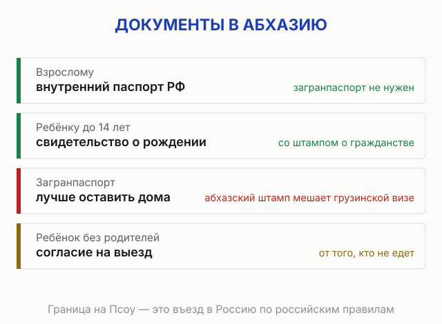
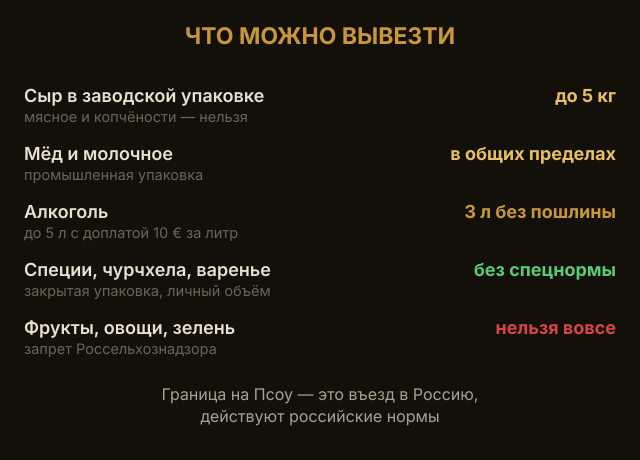

import AffiliateNote from '../../components/post/AffiliateNote.astro';
import { aviasalesRoute, cherehapaCountry, sutochnoRegion } from '../../data/affiliate.js';

Каждое лето одна и та же картина: человек находит билет в Сухум за шесть тысяч, радуется — и тут же лезет проверять, успеет ли сделать загранпаспорт. Спойлер: никуда бежать не надо.

> **Если коротко:** загранпаспорт в Абхазию **не нужен**. Россиян пускают по **внутреннему паспорту РФ**, находиться можно до 90 дней, визы нет. Больше того — загран брать даже **нежелательно**: абхазский штамп в нём потом мешает с визами в другие страны. Детям до 14 лет снова хватает **свидетельства о рождении с красным штампом о гражданстве РФ** — порядок вернули в мае 2026 и он действует до конца 2027 года. На машине — сбор 150 ₽ за временный учёт плюс местная автостраховка от 1000 ₽. Летите прямым рейсом в Сухум — берите тот паспорт, на который куплен билет: перевозчик сверяет документ с бронированием. Гражданам **Беларуси и Казахстана** виза не нужна до двух недель, гражданам большинства других стран — нужна заранее.

<AffiliateNote />

---

## По какому паспорту едут в Абхазию?

**По внутреннему паспорту РФ — его и хватит.** Граница Псоу под Адлером работает круглосуточно, штампов во внутренний паспорт не ставят, виз нет, лимит — 90 дней.

С заграном тоже пустят, но тут есть подвох, о котором ниже.

---

## Нужен ли загранпаспорт, если лететь сразу в Сухум?

**На земле правило одно, а в воздухе к нему добавляется требование авиакомпании.** Посольство Республики Абхазия формулирует общее правило так: при пересечении российско-абхазской границы гражданин России может воспользоваться заграничным либо внутренним паспортом. Про аэропорт отдельной оговорки в этом правиле нет, граница есть граница.

Дальше начинается практика. Рейс в Сухум международный, и аэропорт об этом пишет прямо: пассажиры международных линий проходят таможенный, пограничный, паспортный контроль и контроль безопасности ([аэропорт Сухум](https://sukhumaero.com/rules/predpoletnyy-kontrol/)). Документ у вас посмотрят по всей форме, а не мельком, как на внутреннем рейсе.

Второе условие ставит перевозчик, и оно жёстче первого: на регистрацию нужен тот самый документ, по которому куплен билет. Ввели при покупке данные загранпаспорта — внутренний на стойке не поможет.

**Что делать.** Покупайте билет на тот документ, который реально повезёте, и держите его в ручной клади. Если для вас принципиально не получить абхазский штамп в загран, выбирайте внутренний паспорт на всех трёх этапах сразу: при покупке, на регистрации и на контроле.

**Честно про пробел.** Это единственное место в статье, где я не могу сослаться на прямое правило ведомства: отдельного списка документов для рейса в Сухум не публикуют ни пограничная служба, ни сам аэропорт. Совет выше снимает риск, но нормой не является. Едете впервые и сомневаетесь — надёжнее наземный путь через Псоу, там правило записано словами.

---

## Почему загранпаспорт брать даже вредно?

**Потому что в загран поставят абхазский штамп — а Абхазию большинство стран мира не признаёт.** Грузия считает её своей территорией, и штамп о въезде «не с той стороны» — это формальное нарушение грузинского законодательства с реальным риском запрета на въезд в Грузию. Другие страны вопросов обычно не задают, но зачем вам лишняя отметка, из-за которой потом объясняться на границе?

Внутренний паспорт решает проблему полностью: в него ничего не ставят.

**Важно:** въезжать в Абхазию законно только со стороны России, через границу Псоу. Про соседнюю страну и её правила — в [гайде по Грузии](/blog/georgia-guide-2026/).

---

## Как проходит граница на Псоу и чем добираться от Адлера?

**Пешком через мост предсказуемо, на своей машине — как повезёт.** Пункт пропуска стоит на реке между Адлером и Абхазией и разводит потоки: пешеходы идут одним коридором, автомобили другим. Пешеходная очередь живёт своим темпом и почти не зависит от того, сколько машин скопилось рядом.

Порядок простой. От Адлера до границы довозит местный транспорт, дальше вы переходите мост своими ногами, проходите российский контроль на выезд и абхазский на въезд, а уже на той стороне пересаживаетесь на абхазский транспорт до Гагры, Пицунды или Сухума. Ни один из этих шагов не требует загранпаспорта.

**Сколько стоять — честной цифры не назову.** Очередь зависит от дня недели, времени суток и того, сколько автобусов подошло за полчаса до вас; ведомство таких данных не публикует, а пересказывать чужие впечатления смысла нет. Практический вывод не в минутах, а в другом: если дальше у вас стыковка, поезд или заселение по часам, закладывайте запас и идите пешком, а машину оставляйте на российской стороне.

Дорога до Адлера — отдельная задача, и летом она решается заранее. Поездом дешевле и без возни с багажными нормами, самолётом быстрее. <a href={sutochnoRegion('https://adler.sutochno.ru/', 'zagranpasport_abhazia')} class="aff-cta" rel="sponsored">Найти жильё в Адлере у границы</a> — у самой границы, места на юг разбирают за месяц-полтора. <a href={aviasalesRoute('MOW', 'AER', 'zagranpasport_abhazia')} class="aff-cta" rel="sponsored">Сравнить билеты Москва — Адлер</a> — все авиакомпании в одной выдаче, оплата картой РФ.

---

## Какие документы нужны детям?

Общие правила для всех направлений — с 20 января 2026 года свидетельство о рождении больше не документ для выезда — разобраны в статье [загранпаспорт ребёнку: куда нужен и как оформить](/blog/zagranpasport-rebenku-2026/).

- **До 14 лет:** пограничная служба ФСБ пропускает по **свидетельству о рождении с красным штампом о гражданстве РФ**. Порядок временный, действует **до конца 2027 года** ([сообщение МИД России от 8 мая 2026](https://www.atorus.ru/article/teper-oficialno-detyam-do-14-let-vnov-razreshili-vyezd-iz-rossii-v-abkhaziyu-po-svidetelstvu-o-67909), решение принято Президентом).
- **14–18 лет:** общегражданский или загранпаспорт **плюс оригинал свидетельства о рождении**.

**Почему вокруг этого столько путаницы.** С **20 января 2026 года** свидетельство о рождении убрали из списка проездных документов, и детям до 14 лет стали требовать загранпаспорт. Семьи массово отменяли поездки — продажи туров в Абхазию с детьми у разных туроператоров просели на 5–50%. В мае порядок вернули, но без громких объявлений, поэтому часть родителей и даже турагентов до сих пор уверены, что загран обязателен. Он не обязателен.

**Тонкость, которую почти везде путают:** речь идёт о правилах **выезда из России**, а не въезда в Абхазию. Для абхазской стороны в отношении российских детей ничего не менялось — вопрос решается на российском погранпункте.

Правило распространяется и на **Южную Осетию**.

Отметку о гражданстве проверьте заранее: если красного штампа нет, его ставят в МВД за один визит. На границе без него ребёнка могут развернуть — а с ним и всю семью. Загранпаспорт ребёнка, если он есть, можно взять с собой — но именно как запасной документ в сумке, а не как основной. Если на границе предложат оформить проход по нему, помните: в загран поставят абхазский штамп со всеми последствиями для Грузии, о которых выше. Сначала показывайте свидетельство.

---

## Ребёнок едет не с обоими родителями — что взять?

Это самая частая причина, по которой семью разворачивают на Псоу. Правила тут российские: граница с Абхазией — это выезд из России, и работают статьи 20 и 21 закона № 114-ФЗ ([Посольство Республики Абхазия в РФ](http://www.emb-abkhazia.ru/konsulskie_voprosy/pravila_vezda_v_ra/)).

| Кто везёт ребёнка | Что нужно дополнительно |
|---|---|
| Оба родителя | ничего сверх документов ребёнка |
| **Один из родителей** | ничего — согласие второго **не требуется** |
| **Бабушка, тётя, тренер, друзья семьи** | **нотариальное согласие** от одного из родителей |

**Едет с бабушкой или в детской группе — согласие обязательно.** Нотариальное, и в нём должны быть указаны срок поездки и страна. Без этой бумаги ребёнка из России не выпустят, никакие устные договорённости не помогут. Хватит согласия одного родителя.

**Едет с мамой или папой — никаких согласий не нужно.** Это распространённое заблуждение: второго родителя спрашивать не надо. Но есть исключение: если второй родитель подал заявление о несогласии на выезд, ребёнка не выпустят, и снять запрет можно только через суд. Подан такой запрет или нет, знает миграционная служба — если отношения в семье конфликтные, лучше проверить заранее, а не узнать об этом в очереди на границе.

**Фамилии не совпадают.** Если у ребёнка и сопровождающего родителя разные фамилии — берите документы, которые показывают родство: свидетельство о браке, о разводе, о смене фамилии. Формально это рекомендация, а не требование, но на практике именно из-за несовпадения фамилий чаще всего начинаются вопросы.

---

## Подойдёт ли повреждённый или непоменянный паспорт?

**На границе смотрят не на аккуратность, а на действительность — но повреждение как раз и делает паспорт недействительным.** Внутренний паспорт РФ выручает вас только пока он в порядке. Если он перестал быть действительным, безвизовый режим не спасёт: развернут вместе со всеми, кто едет с вами.

Три причины, по которым паспорт перестаёт работать:

- **возраст.** Паспорт меняют по достижении 20 и 45 лет. Про это забывают чаще всего: человек уверен, что до срока ещё далеко, а день рождения был весной.
- **повреждения.** Залитая страница, размытая печать, оторванный уголок, отклеившаяся или нечитаемая фотография. Правило простое: если данные читаются с трудом, документ спорный, а спорный документ на границе трактуют не в вашу пользу.
- **посторонние отметки.** Любые записи и штампы, которых в паспорте быть не должно, включая шутливые «визы» из турпоездок.

Проверять это надо до покупки билетов, а не в очереди. Замена занимает не один день, и в сезон отпусков очередь на приём тоже есть. Если паспорт потерялся прямо перед выездом, исходите из худшего: поездку придётся сдвигать, а заявление на новый документ подавать сразу, не дожидаясь выходных.

Ребёнку от 14 лет всё сказанное относится в полной мере: его паспорт такой же документ со своими сроками, а свидетельство о рождении с этого возраста основным уже не считается.

---

## Нужен ли загранпаспорт гражданам Беларуси и Казахстана?

**Виза им не нужна, но условия у них другие, и категоричное «загран не нужен» их обманывает.** Правило про внутренний паспорт РФ работает потому, что для России поездка в Абхазию — особый порядок выезда. У гражданина другой страны такого порядка нет, и на границе он показывает свой национальный паспорт.

Что при этом говорит абхазская сторона ([Посольство Республики Абхазия в РФ](http://www.emb-abkhazia.ru/konsulskie_voprosy/pravila_vezda_v_ra/)):

| Кто | Что нужно |
|---|---|
| Граждане Беларуси и Казахстана | **виза не нужна до двух недель**, цель поездки туристическая или деловая |
| Никарагуа, Тувалу, Приднестровье, Южная Осетия | виза не нужна |
| Организованные туристические группы | без визы, но не дольше **24 часов** |
| Граждане остальных стран | **виза заранее** |

Виза оформляется без визита: заявление и копию паспорта отправляют в консульскую службу по электронной почте, рассмотрение занимает **семь рабочих дней**. Тонкость, о которой мало кто предупреждает: после въезда нужно **в течение трёх рабочих дней** прийти в консульскую службу и получить сам документ на руки.

Дольше двух недель в Абхазии белорусу или казахстанцу нужна виза на общих основаниях. Так что если вы зовёте в гости родственников из Минска или Алматы на месяц, планируйте это заранее.

---

## Что оформлять, если едете на машине?

**Два обязательных платежа прямо на границе, оба наличными.** Российский полис ОСАГО в Абхазии не действует, поэтому местная автостраховка обязательна и оформляется на месте вместе с временным учётом.

| Что | Сколько |
|---|---|
| Сбор за временный учёт авто | **150 ₽** |
| Местная автостраховка до 15 суток | **1000 ₽** |
| Местная автостраховка до 30 суток | **1500 ₽** |

Разница между двумя сроками страховки — 500 ₽, и это тот случай, когда экономить не стоит. Полис на 15 суток при поездке «дней на десять, но как пойдёт» превращается в риск: продлевать его сложнее, чем сразу взять с запасом.

Из документов на машину везите то же, что возите обычно: свидетельство о регистрации и права. Если машина не ваша, берите бумагу, подтверждающую право ей управлять, — с чужим автомобилем и без документов на границе разговор будет долгим.

И помните про очередь: автомобильный коридор на Псоу летом идёт заметно медленнее пешеходного. Многие оставляют машину в Адлере, переходят пешком и берут транспорт на абхазской стороне.

---

## Можно ли взять с собой собаку или кошку?

**Можно, но документы на животное оформляют заранее и в два шага.** Порядок вывоза из России общий для всех направлений и описан Россельхознадзором ([правила и запись на оформление](https://777.fsvps.gov.ru/oformlenie-domashnih-zhivotnyh-vyvozimyh-za-rubezh/)):

1. В районной станции по борьбе с болезнями животных получают **ветеринарное свидетельство формы № 1**.
2. В территориальном управлении Россельхознадзора его меняют на **международный ветеринарный сертификат формы 5а**. Заявление и запись — онлайн, через сервис ведомства.

Хорошая новость для абхазского направления: **анализ на титр антител к бешенству здесь не нужен**. Россельхознадзор требует его для закрытого списка стран — Тайвань, Израиль, Индонезия, Южная Корея, Китай, ОАЭ, США, Сингапур, Турция, Япония, Украина. Абхазии в этом списке нет, и это экономит вам и лабораторию, и несколько недель ожидания.

Ветеринарные требования принимающей стороны Россельхознадзор публикует по каждой стране отдельно, поэтому перед поездкой сверьтесь по своему направлению. И закладывайте время: документы на животное не делаются за день до выезда.

---

## Что можно вывезти из Абхазии в Россию?

**Мандарины, фрукты и зелень в сумке — под запретом, и это главное, чего не пишут в списках «что привезти».** Россельхознадзор ввёл временные ограничения на ввоз подкарантинной продукции растительного происхождения в ручной клади и багаже тех, кто едет из Абхазии. Причина не в мандаринах как таковых: с абхазскими фруктами через границу едет коричнево-мраморный клоп — карантинный вредитель для России и всего ЕАЭС. В своём разъяснении Россельхознадзор написал прямо: «действующие временные ограничения на ввоз указанной абхазской продукции в ручной клади и багаже сохраняются». Отмены с тех пор ведомство не публиковало, а в 2025 году Минсельхоз Абхазии признал, что клоп из пришлого вредителя стал местным и вывести его не удалось. Проверено 04.08.2026 по сайту Россельхознадзора.

**Цифры «до 15 кг цитрусовых, а на машине до 50» гуляют по десяткам сайтов, и опоры в правилах у них нет.** Ни ФТС, ни Россельхознадзор такой нормы не публикуют. Общее правило для растительной продукции другое: без фитосанитарного сертификата — не больше 5 кг, а партии тяжелее из Абхазии проходят только через предотгрузочный контроль с сертификатом. Если вам где-то обещали ящик мандаринов «по норме» — это пересказ пересказа, а отвечать за него вы будете на КПП своим ящиком.

**Что везти можно и по каким нормам.** Алкоголь — 3 литра на человека старше 18 лет без пошлины; от 3 до 5 литров придётся оплатить 10 евро за каждый литр сверх нормы, это Решение Совета ЕЭК №107 от 20 декабря 2017 года. Готовые продукты животного происхождения — сыр, копчёности — до 5 килограммов включительно и только в заводской упаковке; домашний сулугуни без маркировки инспектор вправе не пропустить. Мёд и молочные продукты в промышленной упаковке из-под общего ветеринарного запрета выведены отдельными решениями. А что выбрать на рынке и кому что везти — от чурчхелы и специй до вина и мёда — собрал в отдельном разборе [что привезти из Абхазии](/blog/chto-privezti-iz-abhazii-2026/), с теми же нормами одной таблицей.

Одно правило работает всегда и без сверки: везёте что-то в количестве, которое трудно объяснить личным потреблением, — будьте готовы объяснять. Разница между «пара бутылок домой» и «партия на продажу» определяется на глаз инспектором, и спорить с ним в очереди бесполезно.

⚠️ Ограничения по растительной продукции ведомство называет временными, а значит их когда-нибудь снимут. Перед выездом откройте раздел ограничений по Абхазии на сайте Россельхознадзора: там таблица с датами и номерами документов, и она обновляется раньше любых туристических статей.

---

## Что ещё взять кроме паспорта?

**Наличные и медицинскую страховку.** Карты в Абхазии почти не принимают, банкоматов мало, валюта — российский рубль. Снять деньги на месте будет негде, поэтому нужную сумму везите с собой.

Полис ОМС в Абхазии не работает вовсе: медицина для туристов платная, а экстренная эвакуация в Сочи обходится в десятки тысяч рублей. Это та статья расходов, где страховка окупается с первого случая. <a href={cherehapaCountry('abkhazia', 'zagranpasport_abhazia')} class="aff-cta" rel="sponsored">Оформить страховку в Абхазию за пару минут</a> — покрытие подбирается под даты поездки, оплата картой РФ.

---

## Что забронировать до поездки?

**Жильё, потому что его в сезон разбирают, и дорогу до Адлера.** Гостиничного фонда в привычном виде в Абхазии мало: основное — частный сектор и мини-гостиницы, которых нет на больших отельных сайтах. Искать удобнее там, где такое жильё собрано. <a href={sutochnoRegion('https://abkhazia.sutochno.ru/', 'zagranpasport_abhazia')} class="aff-cta" rel="sponsored">Посмотреть жильё в Абхазии с оплатой картой РФ</a> — цены, отзывы и бронь без предоплаты наличными на месте.

Дорогу тоже лучше решить заранее, особенно если едете в июле или августе: и поезда, и самолёты на юг в это время заполняются задолго до дат. Ссылки на расписания — выше, в разделе про границу.

Что бронировать не надо — так это визу и приглашение. Россиянам не нужно ни то, ни другое, и если вам предлагают «оформить документы для въезда в Абхазию» за деньги, вам продают воздух. Единственные обязательные платежи на этом направлении — те два, что берут на границе с автомобилистов.

Порядок сборов получается такой: паспорт, наличные, полис, жильё, дорога. Всё остальное решается на месте.

---

## FAQ

**Нужен ли загранпаспорт в Абхазию россиянам в 2026 году?**
Нет. Хватит внутреннего паспорта РФ. Визы тоже нет, находиться можно до 90 дней.

**Можно ли въехать в Абхазию по загранпаспорту?**
Можно, но не стоит: в загран поставят абхазский штамп, который потом создаёт проблемы с визами, в первую очередь с грузинской.

**Пустят ли ребёнка без загранпаспорта?**
Да. До 14 лет — по свидетельству о рождении с красным штампом о гражданстве РФ. Порядок вернули в мае 2026 после январского запрета, и он действует до конца 2027 года. С 14 лет — по общегражданскому паспорту плюс оригинал свидетельства о рождении.

**Можно ли отправить ребёнка в Абхазию с бабушкой?**
Да, но нужно нотариальное согласие от одного из родителей с указанием срока поездки и страны. Без него ребёнка не выпустят из России. Если ребёнок едет с мамой или папой, никакого согласия не требуется.

**Нужна ли виза гражданам Беларуси и Казахстана?**
До двух недель — нет, при туристической или деловой цели поездки. Дольше двух недель виза нужна.

**Как получить абхазскую визу гражданину другой страны?**
Заявление и копию паспорта отправляют в консульскую службу по электронной почте, рассмотрение занимает семь рабочих дней. После въезда нужно в течение трёх рабочих дней прийти в консульскую службу за самим документом.

**Можно ли въехать в Абхазию со стороны Грузии?**
Законного пути с той стороны нет: Грузия считает такой въезд нарушением своего законодательства. Единственный легальный маршрут — через российскую границу Псоу.

**Ставят ли штамп во внутренний паспорт?**
Нет. Во внутренний паспорт на границе Псоу ничего не ставят.

---

## Что почитать дальше

* [Абхазия 2026: стоит ли ехать и безопасно ли отдыхать](/blog/abkhazia-2026/) — большой честный разбор: цены, отзывы, маршрут
* [Виза в Абхазию для россиян](/visa/abkhazia/) — сроки пребывания, сборы и правила въезда одной страницей
* [Куда ещё пускают без визы в 2026](/bezviz/) — таблица направлений: сроки, условия, где хватит внутреннего паспорта
* [Гагра 2026](/blog/gagra-2026/) — пляжи, жильё и что посмотреть на главном курорте
* [Озеро Рица](/blog/ozero-ritsa-2026/) — как добраться и сколько стоит въезд в нацпарк
* [Новоафонская пещера](/blog/novoafonskaya-peschera-2026/) — билеты, расписание поезда и как не попасть в толпу
* [@traveltriberu](https://t.me/traveltriberu) — оперативные обновления по границам в Telegram

---

*Актуально на: 3 августа 2026. Правила въезда проверены по действующим требованиям пограничной службы; перед поездкой сверяйтесь с официальными источниками — правила могут меняться.*
