import PricingCards from '../../components/post/PricingCards.astro';
import FlightRoutes from '../../components/post/FlightRoutes.astro';
import AffiliateNote from '../../components/post/AffiliateNote.astro';
import { TP_LINKS, airaloSub, aviasalesRoute, cherehapaCountry, cherehapaTravel, ostrovokCountry, youtravelSub } from '../../data/affiliate.js';

export const tours = youtravelSub('zanzibar_2026');
export const flights = aviasalesRoute('MOW', 'ZNZ', 'zanzibar_2026');
export const stay = ostrovokCountry('tanzania', 'zanzibar_2026');
export const insurance = cherehapaTravel('zanzibar_2026');
export const esim = airaloSub('zanzibar_2026');

Занзибар лежит в нескольких десятках километров от материковой Африки, и добраться до него из Москвы всегда было делом со стыковкой и сутками в пути. Летом 2026 года это изменилось: борт Air Tanzania стал садиться в аэропорту Абейд Амани Каруме без промежуточной посадки в Европе или Персидском заливе.

Изменение с оговоркой. Программа рейсов сезонная, и её заявленный конец приходится на 24 октября 2026 года.

> **Если коротко:** прямые рейсы Москва — Занзибар летают с 2 июля 2026 года по вторникам, четвергам и субботам, программа заявлена **до 24 октября**. Виза оформляется онлайн и стоит **50 $** за одну поездку до 90 дней (**4 258 ₽** по курсу ЦБ 85,1645 ₽ за доллар на 19.08.2026), многократная — **100 $**. Отдельно и обязательно покупается въездной полис Занзибара: только через государственный портал, максимум **92 дня** подряд. Берег выбирают до отеля: на севере купаться можно в любой час, на востоке отлив уводит воду на сотни метров. Медпомощь на острове платная, а до хорошей клиники — перелёт на материк: <a href={cherehapaCountry('tanzania', 'zanzibar_2026_tldr')} class="aff-cta" rel="sponsored">подобрать страховку на Занзибар</a>. <a href={tours} class="aff-cta" rel="sponsored">Посмотреть авторские туры по Танзании</a> — YouTravel собирает программы малых групп с гидом, видно даты, размер группы и что входит в цену, включая парковые сборы на сафари. 

<AffiliateNote />

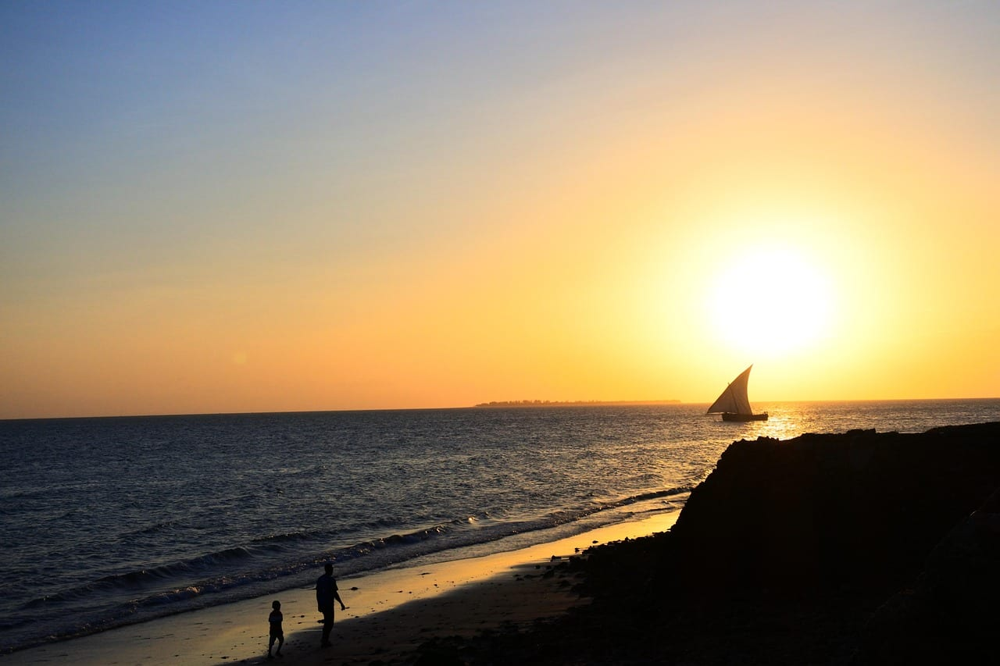

## Почему про Занзибар заговорили именно в 2026 году

Причина одна и техническая: появился прямой рейс. О выходе Air Tanzania на Россию объявила президент Танзании Самия Сулуху Хассан на Петербургском экономическом форуме в июне 2026 года, первый борт вылетел 2 июля.

До этого путь на остров складывался из двух перелётов через Стамбул, Дубай, Доху или Аддис-Абебу. По оценке Ассоциации туроператоров России от 02.06.2026, стыковочная связка обходилась в **700–850 $** на человека, то есть в 59 600–72 400 ₽ по курсу на 19.08.2026.

Рейсы ставит Boeing 787 три раза в неделю. Из Москвы вылет по вторникам, четвергам и субботам в 10:40, обратно борт уходит из Дар-эс-Салама в 23:30 по понедельникам, средам и пятницам и прилетает в Москву в 08:40.

В конце июля перевозчик развернул маршрут: теперь он идёт Дар-эс-Салам — Занзибар — Москва — Занзибар — Дар-эс-Салам, и пассажирам острова не нужно пересаживаться на материке. Об этом сообщили 29.07.2026, и письменного объявления авиакомпании к тому моменту не выходило — рейсы летали по новой схеме раньше, чем она была описана.

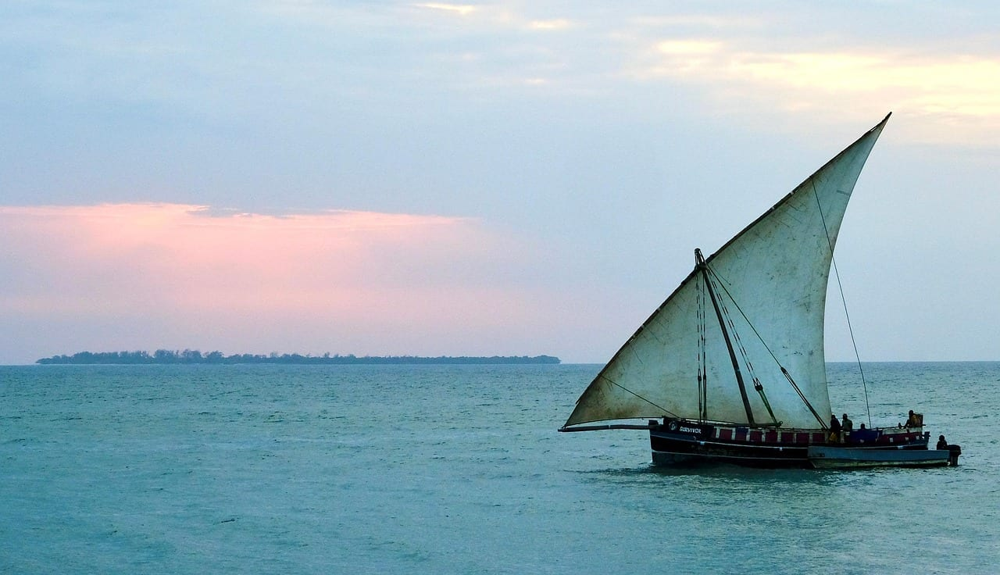

## Чем север Занзибара отличается от востока

Остров вытянут с севера на юг, и берега у него ведут себя по-разному. Разница не в красоте, а в приливе, и она решает, каким будет отдых.

Север — это Нунгви и Кендва. Перепад воды здесь небольшой, купаться можно в любой час, у берега сразу глубина. Отсюда же уходят лодки к рифам и на Мнембу.

Восток — Пае, Джамбиани, Матемве. Отлив здесь уводит океан на сотни метров, обнажая лагуну с морской травой и водорослевыми плантациями. Утром это фотогеничная полоса мокрого песка, к обеду вода возвращается. Плавать по расписанию прилива нравится не всем.

Юго-запад, Кизимкази и окрестности, тише и дешевле, но пляжи там хуже, а вода мутнее из-за близости мангров.

| берег | купание | что там хорошо | чем разочарует |
|---|---|---|---|
| Нунгви, Кендва (север) | в любой час | закаты, дайвинг, ночная жизнь | людно, дороже всего |
| Пае, Джамбиани (восток) | по расписанию отлива | кайт, длинные пустые пляжи, дешевле | днём вместо моря песок, водоросли зимой |
| Матемве (северо-восток) | по расписанию отлива | тихо, близко к Мнембе | почти нет инфраструктуры |
| Кизимкази (юго-запад) | круглосуточно | дельфины, цены | пляжи слабые, вода мутная |

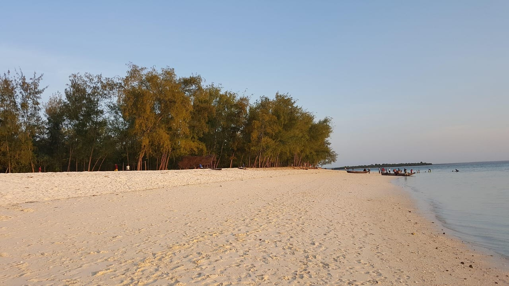

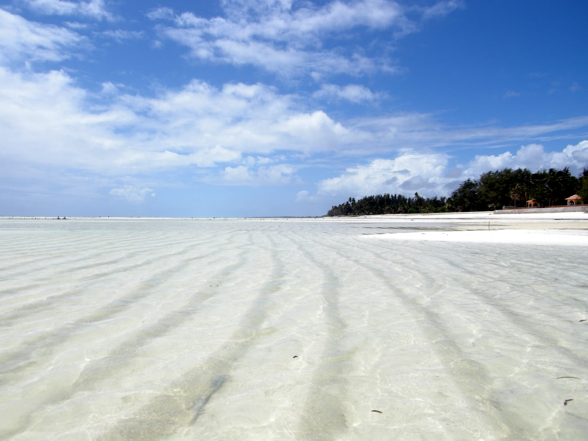

Кадр отлива на Пае — Matt Kieffer, лицензия CC BY-SA.

<a href={stay} class="aff-cta" rel="sponsored">Подобрать отель на Занзибаре по берегам</a> — Островок показывает цены в рублях, у части объектов бесплатная отмена, оплата российской картой проходит.

## Когда на Занзибаре сезон дождей?

**Сезонов дождей два, и они называются Masika и Vuli.** Так их называет метеослужба Танзании в своих сезонных прогнозах: Masika — с марта по май, Vuli — с октября по декабрь.

Masika сильнее. Это длинные дожди, они приходят ливнями во второй половине дня, апрель считается самым мокрым месяцем года. Часть отелей на востоке в апреле закрывается на ремонт.

Vuli мягче. Короткие дожди идут послеобеденными зарядами, между которыми держится солнце, и поездку они ломают редко.

Остальное — сухие окна. Июнь-сентябрь: жара умеренная, влажность ниже, ветер с юга. Январь-февраль: жарче и безветреннее, вода самая тёплая.

Здесь стоит сказать прямо: прямые рейсы 2026 года попадают ровно в хорошее окно и заканчиваются 24 октября, за неделю-две до разгона Vuli. Совпадение удобное, но оно означает, что зимой лететь придётся снова со стыковкой.

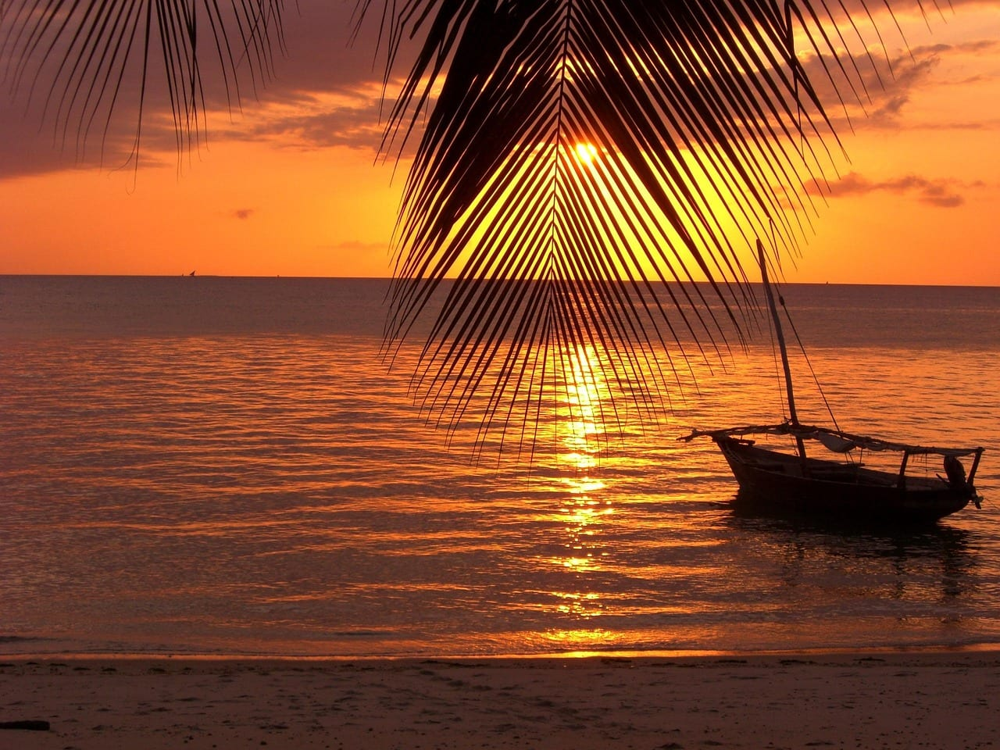

## Когда на восточных пляжах водоросли?

**Водоросли выносит на восточный берег с ноября по апрель, сильнее всего в конце этого окна.** Их гонит северо-восточный муссон, который здесь зовут касказ, и он же приносит на берег то, что растёт на подводных плантациях.

Водорослевые фермы на востоке — не мусор, а хозяйство: женщины Пае и Джамбиани выращивают красные водоросли на кольях и сдают на переработку. Часть урожая и обрывков оседает на песке.

На севере этого нет. Нунгви и Кендва повёрнуты иначе, и муссон туда водоросли не заносит.

Обходится проблема тремя способами. Первый — ехать на север. Второй — ехать на восток в июне-октябре, когда ветер другой. Третий — смотреть отель с бассейном и не рассчитывать на купание в океане каждый день.

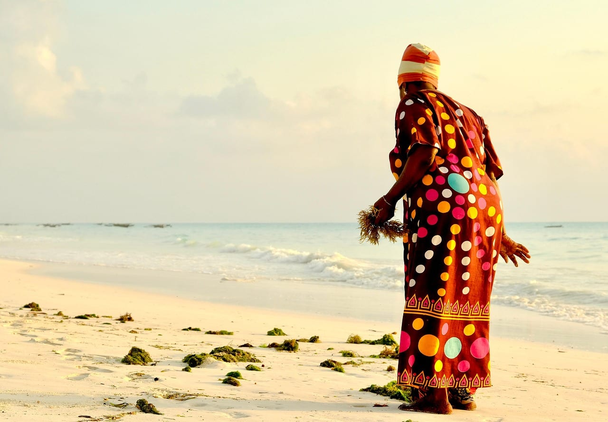

## Сколько лететь и что будет после 24 октября

Обратный рейс Дар-эс-Салам — Москва по расписанию занимает девять часов десять минут: вылет в 23:30, прилёт в 08:40. Дорога на юг сопоставима, разницы часовых поясов между Москвой и Танзанией нет.

После окончания программы остаются те же стыковки, что были до июля: Turkish Airlines через Стамбул, Emirates через Дубай, Qatar Airways через Доху, Ethiopian Airlines через Аддис-Абебу. Общее время в пути — 14–20 часов в зависимости от длины пересадки.

<FlightRoutes routes={[
 {
 from: 'Москва', to: 'Занзибар',
 flights: [
 { airline: 'Air Tanzania', code: 'TC', duration: 'около 10 ч', priceFrom: 'прямой, вт/чт/сб до 24.10.2026' },
 { airline: 'Turkish Airlines', code: 'TK', duration: '14–17 ч', priceFrom: 'через Стамбул' },
 { airline: 'Emirates', code: 'EK', duration: '15–18 ч', priceFrom: 'через Дубай' },
 { airline: 'Qatar Airways', code: 'QR', duration: '15–19 ч', priceFrom: 'через Доху' },
 { airline: 'Ethiopian Airlines', code: 'ET', duration: '14–20 ч', priceFrom: 'через Аддис-Абебу' },
 ]
 },
]} caption="Как добираются на Занзибар из Москвы в 2026 году" />

<a href={flights} class="aff-cta" rel="sponsored">Проверить цены Москва — Занзибар по датам</a> — Aviasales показывает календарь на месяц вперёд и сравнивает прямой рейс со стыковочными, оплата российской картой, билет приходит на почту.

## Шесть сценариев поездки

Занзибар редко бывает самостоятельной целью на две недели: пляжного содержания там на неделю, дальше нужен либо дайвинг, либо материк. Ниже шесть рабочих схем, у каждой назван честный минус.

**Неделя на севере, без машины.** Прилёт, трансфер в Нунгви за час с небольшим, семь ночей на одном месте. Купание в любой час, закаты, лодка на Мнембу. Минус: к четвёртому дню север обойдён весь, а людей там больше, чем где-либо на острове.

**Десять дней «север плюс восток».** Пять ночей в Кендве, переезд через Стоун-Таун, пять ночей в Джамбиани. Два разных острова за одну поездку. Минус: переезд съедает день, а на востоке придётся жить по приливу.

**Неделя для кайта.** База в Пае с июня по сентябрь, когда дует ровный юго-восточный ветер. Минус: вне ветреного окна смысла нет, а купание в лагуне на отливе невозможно.

**Двенадцать дней «остров плюс сафари».** Четыре ночи на побережье, перелёт до Килиманджаро или Аруши, четыре-пять ночей в Тарангире, Нгоронгоро и Серенгети, возврат на побережье. Минус: это дорого и утомительно, внутренний перелёт и джип добавляют к бюджету больше, чем сам остров. Насколько именно — считано в [разборе, сколько стоит день в парке в шести странах](/blog/safari-afrika-2026/): один день в кратере Нгоронгоро на четверых в джипе выходит 13 384 ₽ с человека.

**Неделя дайвинга.** Мнемба, Лихоле, риф Тумбату; база в Нунгви или Матемве. Минус: Мнемба — частный остров, снорклинг у рифа доступен, а сам берег закрыт; за вход в морской заповедник платят отдельно.

**Долгая зимовка.** Полис покрывает до 92 дней подряд, виза даёт 90, аренда дома на востоке в низкий сезон дешевле недельного отеля. Минус: интернет на острове нестабилен, а медицина за пределами Стоун-Тауна слабая.

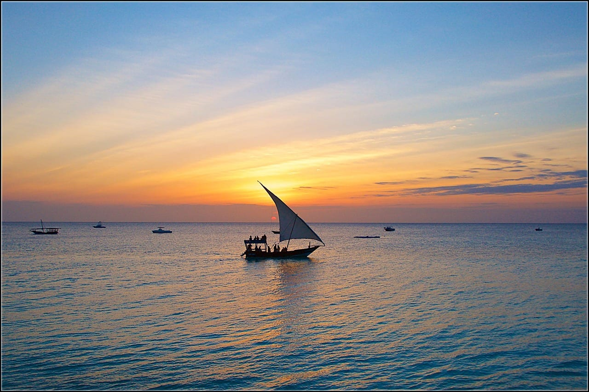

## Сколько дней закладывать и что из чего складывается

| дней | что складывается | чего не будет |
|---|---|---|
| 5–6 | один берег, один-два выезда | Стоун-Таун впопыхах, материка нет |
| 7–8 | берег плюс Стоун-Таун плюс специи и Джозани | второго берега нет |
| 10 | север и восток, полный день в Стоун-Тауне | сафари нет |
| 12–14 | остров плюс четыре-пять ночей на материке | спокойного темпа нет |
| 16+ | остров, материк, Килиманджаро или Пемба | цена растёт быстрее впечатлений |

Дорога отнимает два дня даже на прямом рейсе. Поездка короче пяти ночей превращается в перелёт ради перелёта.

## Сколько времени нужно на Стоун-Таун?

**На Стоун-Таун хватает одного полного дня, ночевать там необязательно.** Старый город внесён в список Всемирного наследия и обходится пешком за несколько часов: резные двери, рынок Дараджани, форт, бывший невольничий рынок с мемориалом, набережная Фородхани с вечерними жаровнями.

Резные двери — то, ради чего сюда идут отдельно. Латунные шипы на створках — индийский мотив, резьба по косяку — арабская и суахилийская.

Рядом продают экскурсию на «плантации специй»: гвоздика, мускатный орех, корица, ваниль. Это полудневная прогулка с дегустацией, а не музей, и ожиданий выше уровня «интересно понюхать» она не оправдывает.

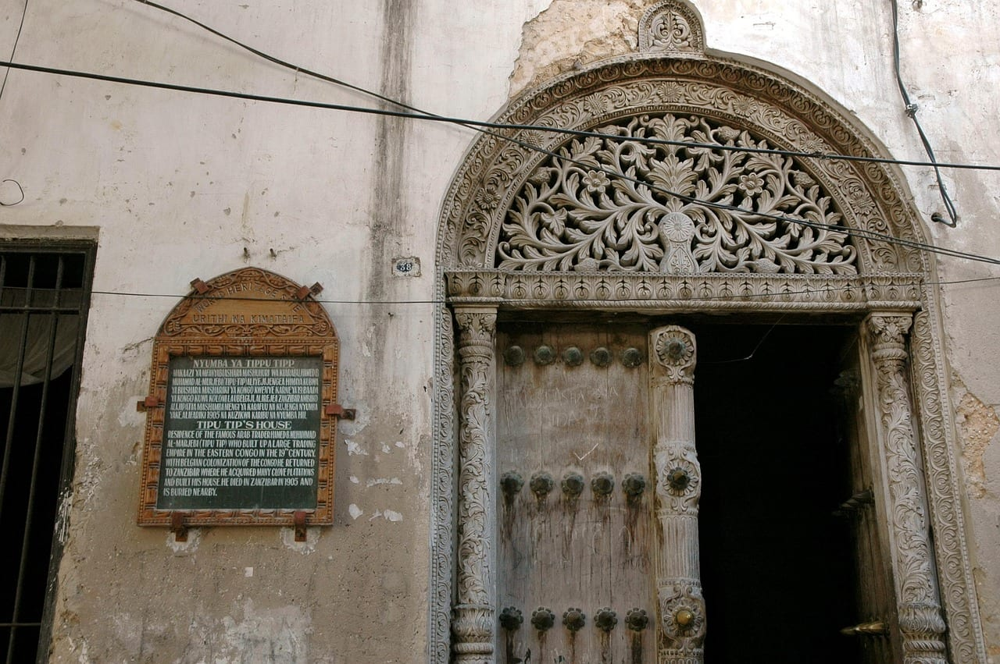

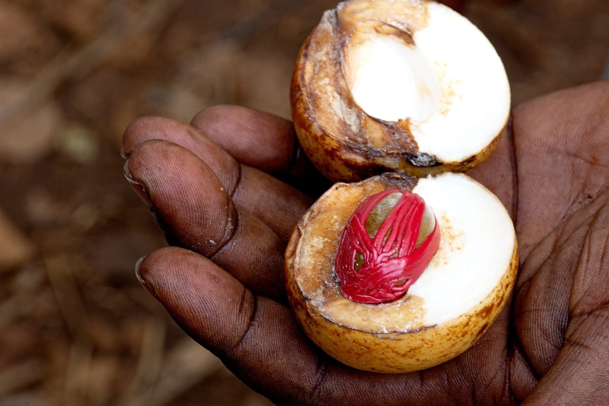

Из Стоун-Тауна же уходят лодки на островок с пирсом и черепахами напротив города.

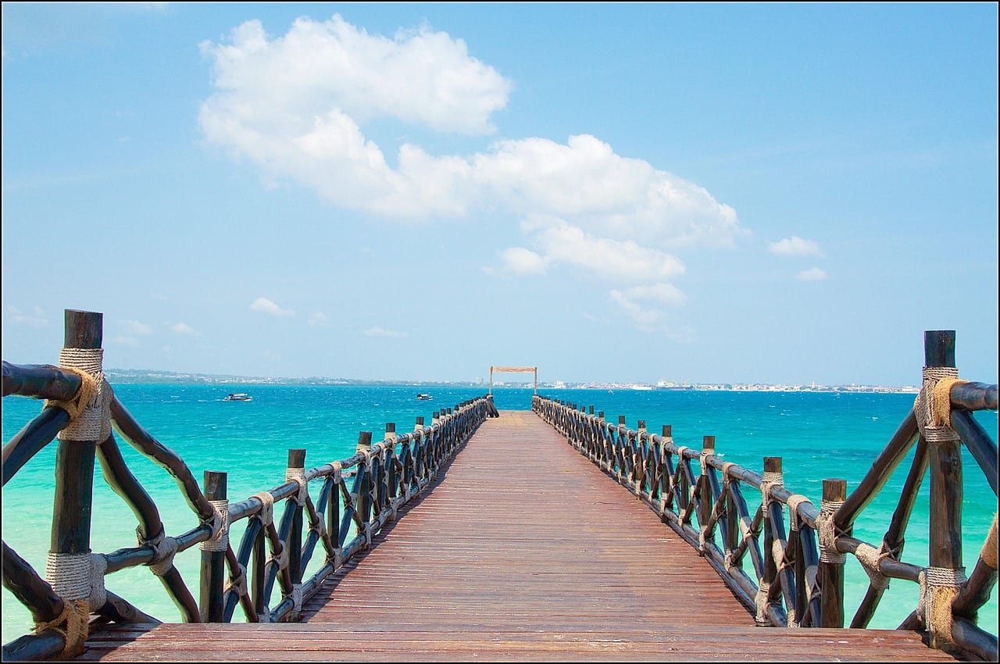

## Стоит ли добавлять сафари на материке?

**Стоит, если есть двенадцать дней и более; на меньшем сроке сафари съест поездку.** Между островом и парками нет короткой дороги: нужен внутренний перелёт до Килиманджаро или Аруши, дальше джип и переезды по грунту.

Северный круг — это Тарангире со слонами и баобабами, кратер Нгоронгоро с постоянным стадом на дне и Серенгети. Минимум под него — четыре ночи, комфортно — пять-шесть.

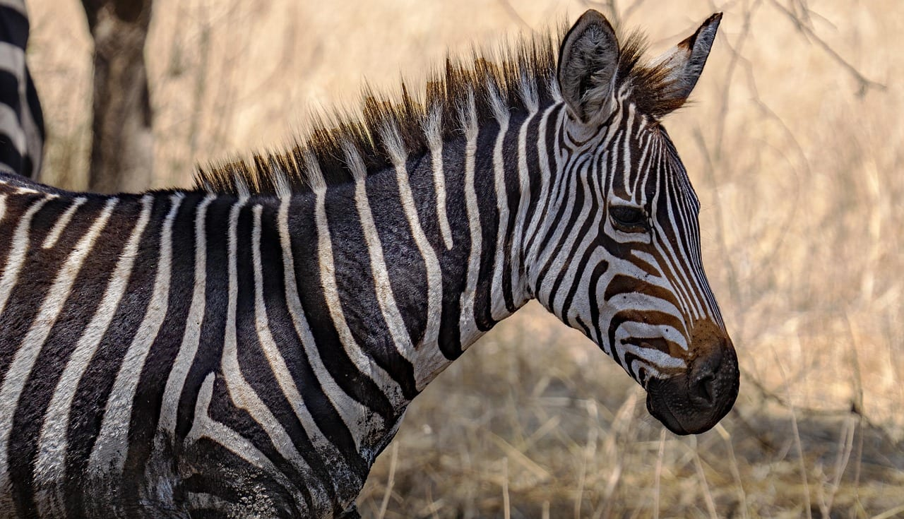

Нгоронгоро — обрушившийся вулканический кратер около двадцати километров в поперечнике; животные живут внутри круглый год, поэтому шанс увидеть много за один день там выше, чем в Серенгети.

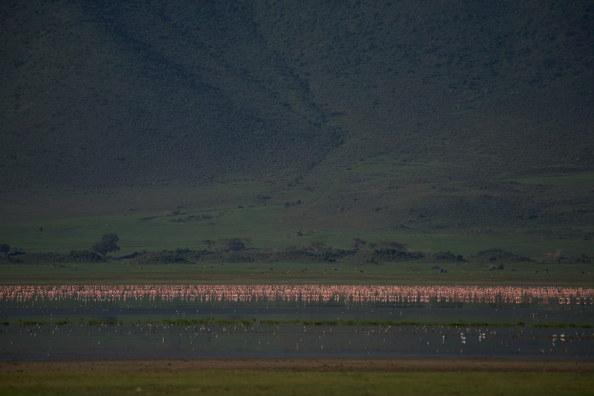

Килиманджаро добавляют отдельно: подъём занимает от пяти до девяти дней в зависимости от маршрута, и совместить его с пляжем в одну двухнедельную поездку не выйдет.

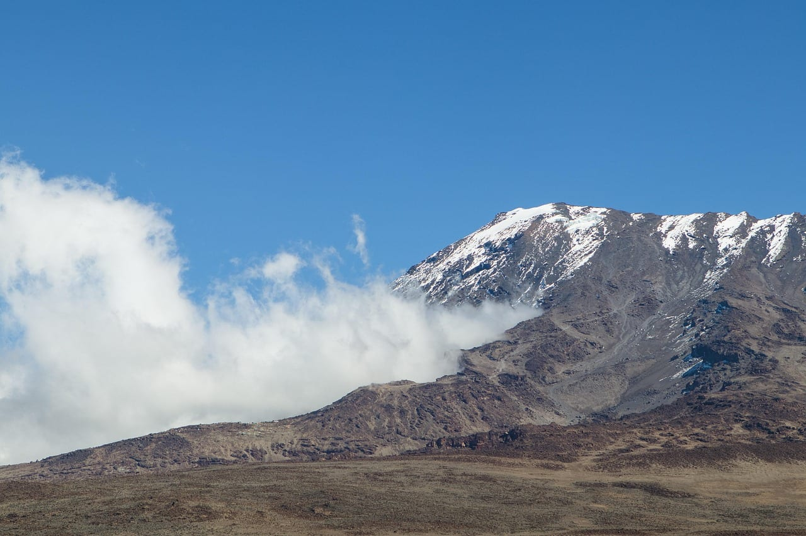

<a href={tours} class="aff-cta" rel="sponsored">Сравнить программы сафари по Танзании</a> — YouTravel собирает авторские маршруты малых групп, в карточке видно число ночей в каждом парке и что входит в цену, включая парковые сборы.

## Нужна ли виза на Занзибар и сколько она стоит?

**Да, виза нужна, и оформляется она онлайн заранее.** Отдельной занзибарской визы нет: одна электронная виза Танзании действует и на материке, и на острове.

По официальному порталу иммиграционной службы, сверено 19.08.2026: обычная виза на один въезд стоит **50 $** и даёт срок пребывания до 90 дней, многократная — **100 $**. По курсу ЦБ 85,1645 ₽ за доллар на 19.08.2026 это **4 258 ₽** и **8 516 ₽**.

В обязательный пакет входят страница паспорта с данными, фотография и **обратный билет**. Заявку рассматривают внутри системы, решение приходит на почту, статус отслеживается онлайн.

Отдельно про оплату. Портал принимает карты Visa и Mastercard, поэтому российской картой сбор не пройдёт: понадобится карта иностранного банка или помощь того, у кого она есть. Это самый частый затык при самостоятельном оформлении.

## Кому нужен обязательный полис Занзибара и что он покрывает?

**Полис обязателен для всех, кто въезжает на Занзибар, и купить его можно только через государственный портал.** Обычная туристическая страховка его не заменяет — это отдельный въездной документ, а не выбор страховщика.

По разделу вопросов того же портала, сверено 19.08.2026, полис действует внутри Танзании максимум **92 дня подряд** по датам, указанным в сертификате. Покрытие: экстренная медицинская помощь, репатриация тела и медицинская эвакуация, несчастный случай, задержка, кража и потеря багажа, юридические расходы и гражданская ответственность.

Тарифы разведены по составу поездки: отдельный полис для одного-двух человек, семейный на трёх-девятерых, групповой от десяти человек со скидкой взрослым, и отдельная категория для иностранных студентов. Дети до двух лет проходят бесплатно, с трёх до семнадцати платят половину, студенты освобождены.

Цену портал показывает после заполнения анкеты с паспортными данными. Профильные ассоциации и туроператоры называют **44 $** (около 3 747 ₽ по курсу на 19.08.2026), но официального прейскуранта в открытом виде на портале нет — считайте эту цифру ориентиром, а не гарантией.

Материковая Танзания — отдельная история. Обязательный въездной полис для материка объявляли с января 2026 года, однако подтверждения того, что требование применяется на границе, на 19.08.2026 найти не удалось. Если поездка включает сафари, разумнее иметь нормальный полис сверх занзибарского: у въездного лимиты небольшие, а эвакуация из Серенгети стоит дорого.

<a href={insurance} class="aff-cta" rel="sponsored">Подобрать полис с покрытием на сафари</a> — Черехапа сравнивает предложения страховых, оплата российской картой, полис приходит в PDF; занзибарский въездной документ он не отменяет, но закрывает то, на что у въездного не хватает лимита.

## Сколько стоит поездка и что на Занзибаре разочаровывает

Считаем неделю на двоих в сухой сезон, самостоятельно, без сафари.

| статья | на двоих | комментарий |
|---|---|---|
| перелёт | от 83 000 ₽ | ориентировочно, по витринам билетов на 19.08.2026 |
| виза | 8 516 ₽ | по 50 $ на человека, курс ЦБ 85,1645 ₽ |
| въездной полис | около 7 494 ₽ | ориентир по 44 $ на человека, официального прейскуранта нет |
| жильё, 7 ночей | 45 000–90 000 ₽ | север дороже востока |
| еда и трансферы | 25 000–40 000 ₽ | ориентировочно, ужин на двоих 2 500–5 000 ₽ |
| выезды и заповедники | 10 000–20 000 ₽ | Мнемба, специи, Джозани |

Итого сухой минимум — около 180 000 ₽ на двоих за неделю, комфортный вариант ближе к 250 000 ₽. Цены перелёта и жилья взяты с витрин на 19.08.2026 и меняются, курс — ЦБ на ту же дату.

Связь стоит взять до вылета. Роуминг дорогой, местную симку продают в аэропорту, но электронная карта связи включается сразу после посадки.

<a href={esim} class="aff-cta" rel="sponsored">Взять интернет на Танзанию до вылета</a> — Airalo продаёт электронные карты связи с посуточными пакетами, подключение до поездки, физическая симка не нужна.

Теперь о недостатках, которых не пишут в описаниях отелей.

Российские карты на острове не работают нигде. Наличные доллары нужны на визу, чаевые, лодки и рынки; менять лучше в Стоун-Тауне, а не в отеле.

Отлив на востоке разочаровывает сильнее всего остального. Люди бронируют «пляж с фотографии», прилетают и обнаруживают, что море ушло до горизонта до четырёх часов дня.

Медицина за пределами Стоун-Тауна слабая. Серьёзный случай означает эвакуацию, и это ровно тот сценарий, ради которого нужен полис с нормальным лимитом.

Занзибар — мусульманский остров с собственными правилами. На пляже и в отеле принято по-курортному, в деревнях и Стоун-Тауне закрытые плечи и колени избавят от лишнего внимания. В Рамадан днём закрыта часть кафе вне отелей.

Комары есть, и малярия здесь встречается. Репеллент и вопрос профилактики врачу — не лишняя предосторожность, а обычная подготовка к поездке в этот регион.

## FAQ

**Нужна ли виза на Занзибар россиянам в 2026 году?**
Да. Электронная виза Танзании действует и на острове, и на материке: одна поездка — 50 $ на срок до 90 дней, многократная — 100 $ (официальный портал иммиграционной службы, сверено 19.08.2026).

**Правда ли, что на Занзибар нужна отдельная обязательная страховка?**
Да. Въездной полис Занзибара покупается только через государственный портал и не заменяется обычной туристической страховкой. Срок покрытия — максимум 92 дня подряд.

**Сколько стоит обязательный полис?**
Портал показывает цену после заполнения анкеты. Туроператоры и профильные ассоциации называют 44 $, около 3 747 ₽ по курсу ЦБ на 19.08.2026; открытого прейскуранта на портале нет.

**Есть ли прямые рейсы из Москвы?**
Да, с 2 июля 2026 года Air Tanzania летает по вторникам, четвергам и субботам. Заявленная программа заканчивается 24 октября 2026 года.

**Когда лучше ехать на Занзибар?**
Июнь-сентябрь и январь-февраль — сухие окна. Сезоны дождей по метеослужбе Танзании: Masika с марта по май, Vuli с октября по декабрь.

**Когда на Занзибаре водоросли?**
С ноября по апрель и только на восточном берегу — их приносит северо-восточный муссон. На северных пляжах, у Нунгви и Кендвы, водорослей нет.

**Где лучше жить — на севере или на востоке?**
На севере купаться можно в любой час, на востоке отлив уводит воду на сотни метров. Если купание важнее цены, выбирайте север.

**Можно ли совместить Занзибар и сафари?**
Можно, но нужен запас в двенадцать дней и более: до парков добираются внутренним перелётом до Килиманджаро или Аруши, а на северный круг закладывают минимум четыре ночи.

**Работают ли российские карты?**
Нет. Нужны наличные доллары и карта иностранного банка, в том числе для оплаты визового сбора на портале.

**Сколько стоит неделя на двоих?**
Сухой минимум около 180 000 ₽ без сафари, комфортный вариант ближе к 250 000 ₽. Расчёт по витринам и курсу ЦБ на 19.08.2026.

**Нужны ли прививки?**
Требование по жёлтой лихорадке зависит от того, из какой страны вы прилетаете, и его стоит уточнить в консульстве Танзании перед вылетом: этот пункт мы не сверяли по первоисточнику. Малярия в регионе встречается — вопрос профилактики обсудите с врачом до поездки.

**Безопасно ли на Занзибаре?**
Насильственная преступность против туристов редка, обычные риски — карманные кражи в Стоун-Тауне и на рынках. Правила поведения в мусульманской стране снимают большую часть проблем.

## Что почитать дальше

- [Кения 2026: сафари в Масаи-Мара](/blog/kenya-guide-2026/) — соседний вариант африканского сафари и чем он отличается от танзанийского
- [Уганда: сафари и горные гориллы](/blog/uganda-safari-2026/) — третий маршрут по Восточной Африке
- [Танзания: коротко о направлении](/tanzania/) — визы, сезоны и бюджет одной страницей
- [Страховка для путешествий 2026](/blog/strahovka-dlya-puteshestviy-2026/) — как выбирать покрытие и на что смотреть в лимитах
- [Как платить за границей в 2026 году](/blog/pay-abroad-2026/) — что делать там, где российские карты не работают

---

Данные проверены 19 августа 2026 года по официальному порталу электронных виз Танзании, порталу Революционного правительства Занзибара, публикациям метеослужбы Танзании и курсу Банка России на эту дату. Визовые правила, тарифы и расписания меняются: перед поездкой сверяйтесь с первоисточниками, ссылки на них приведены в журнале проверок выше. Цены перелёта и жилья взяты с открытых витрин и носят ориентировочный характер.

Больше заметок о поездках — в канале [@traveltriberu](https://t.me/traveltriberu).
