import AffiliateNote from '../../components/post/AffiliateNote.astro';
import { aviasalesRoute, cherehapaTravel } from '../../data/affiliate.js';

export const yerevanFlight = aviasalesRoute('MOW', 'EVN', 'zimovka_2027_armenia_flight', 10);
export const hurghadaFlight = aviasalesRoute('MOW', 'HRG', 'zimovka_2027_egypt_flight', 10);
export const sharmFlight = aviasalesRoute('MOW', 'SSH', 'zimovka_2027_dahab_flight', 10);
export const dubaiFlight = aviasalesRoute('MOW', 'DXB', 'zimovka_2027_uae_flight', 10);
export const goaFlight = aviasalesRoute('MOW', 'GOI', 'zimovka_2027_goa_flight', 10);
export const danangFlight = aviasalesRoute('MOW', 'DAD', 'zimovka_2027_vietnam_flight', 10);
export const insurance = cherehapaTravel('zimovka_2027_insurance');

Зимовка ломается не о деньги и не о погоду. Она ломается о штамп в паспорте: срок пребывания кончается раньше, чем зима.

К сезону 2026/27 это стало заметнее, потому что у двух самых обжитых зимовок правила поменялись в одном году. Я снял цены перелёта сам и разложил семнадцать точек по ярусам — но сначала про то, что изменилось.

> **Если коротко:** **Таиланд с 15 сентября 2026 года пускает россиян на 30 дней вместо 60** — общая безвизовая мера их больше не касается, работает двустороннее соглашение ([консульский департамент МИД Таиланда](https://consular.mfa.go.th/th/content/20-5-69-0000), [посольство Таиланда в Москве](https://moscow.thaiembassy.org/en/content/101305-announcement-no-1-2562-visa-exemption-for-holders-of-russian-passports)). **Черногория с 1 ноября 2026 года закрывает безвиз** — виза категории C, сбор 35 €, деньги из расчёта 50 € на каждый день поездки ([правительство Черногории](https://www.gov.me/en/article/visas)). Самый длинный легальный срок без бумаг даёт **Грузия — 365 дней**, за ней **Армения 180**. Дорога туда-обратно на окно «ноябрь — март» стоит от **40 127 ₽** (Ереван) до **170 079 ₽** (Пномпень), и ярус считается по дороге: стоимость самой жизни мы не измеряли и чужие сводные таблицы за источник не берём. <a href={yerevanFlight} class="aff-cta" rel="sponsored">Посмотреть перелёт Москва — Ереван</a> — Aviasales откроет маршрут с датой в середине ноября, свои дни подставьте сами.

<AffiliateNote />

## Что поменялось к этой зиме

**Таиланд.** Королевская газета опубликовала новые меры 31 августа 2026 года, и с 15 сентября общий безвизовый въезд перекроили: часть стран получила 30 дней, часть 15. России в этих списках нет — россияне въезжают по двустороннему соглашению, и оно даёт **30 дней вместо прежних 60**. Кто прилетел до 14 сентября включительно, свой срок сохраняет полностью: консульский департамент прямо описывает переходное правило. Для зимовщика это разворот привычки: раньше один въезд закрывал два месяца, теперь — один.

**Черногория.** С 1 ноября 2026 года безвизовый въезд для россиян отменяется, и это касается всех типов поездок, включая транзит. Виза категории C стоит **35 € для взрослого и 17,5 € для ребёнка до 14 лет**, подтверждать деньги нужно из расчёта **50 € на каждый день** запрошенного пребывания, подача только личная. Закон отводит на решение десять дней с продлением до 30, а визовый центр называет ориентир «минимум две-три недели». Отдельное правило, которое почти не попадает в русскоязычные разборы: **освобождение от визы на 30 дней** есть у тех, у кого действует шенгенская виза, виза США, Великобритании или Ирландии либо вид на жительство в ЕС. Подробности — в [разборе черногорской визы](/blog/montenegro-visa-2026/).

**Египет.** Тут наоборот: страна оказалась щедрее своей репутации. МИД России пишет, что виза стоит **30 долларов**, действует **месяц** и продлевается в местных миграционных органах **ещё на два месяца бесплатно**. То есть Египет легально держит зимовщика три месяца за тридцать долларов. Ловушка — в бесплатном «синайском штампе»: он даётся при въезде через Шарм-эль-Шейх, годен **15 дней** и только в пределах курортной зоны Южного Синая. Для двухнедельного отпуска это подарок, для зимовки — нет.

**Куба.** В списке зимовок её нет, и это не забывчивость: прямого авиасообщения с Россией нет с 12 февраля 2026 года, а 7 сентября 2026 года «Аэрофлот» сказал, что в зимнем сезоне 2026/27 Кубу не планирует. Что там сейчас с электричеством, деньгами и ценой дороги — в разборе [«Туры на Кубу: почему их нет»](/blog/kuba-tury-2027/).

## Ярус — это дорога, а не жизнь

Ниже семнадцать точек, разложенных по цене перелёта из Москвы: вылет в ноябре 2026 года, возврат в марте 2027-го, два самых дешёвых билета в каждую сторону сложены.

Ярус ниже отвечает ровно на один вопрос — сколько стоит вход. Во сколько обойдётся сам месяц, мы не измеряли, и в разделе «Что мы не измеряли» я говорю об этом прямо. Складывать одно с другим на глаз не выйдет: билет в Чиангмай стоит 113 347 ₽, а в Дубай 74 574 ₽, но что из этого окажется дороже за три месяца — вопрос про аренду и еду, а не про дорогу.

Второе, что видно по таблице: **обратный билет в марте почти везде дороже ноябрьского**. Дананг — 62 438 ₽ туда и 74 263 ₽ обратно, Чиангмай 51 268 и 62 079. Исключений из семнадцати четыре: Пхукет (обратный дешевле на 6 900 ₽), Ереван (на 1 557 ₽), Хургада (на 270 ₽) и Бали (на 1 390 ₽). Считать бюджет по цене «туда» и удваивать нельзя.

| Ярус по дороге | Сколько точек | Кто внутри |
|---|---:|---|
| до 60 000 ₽ | 6 | Ереван, Анталья, Батуми, Хургада, Дахаб, Агадир |
| 60 000 – 110 000 ₽ | 4 | Подгорица, Дубай, Маскат, Пхукет |
| свыше 110 000 ₽ | 7 | Чиангмай, Гоа, Коломбо, Бали, Себу, Дананг, Пномпень |

## Сколько дней пустят по российскому паспорту

Это главный столбец при выборе зимовки, и он же чаще всего устаревает в чужих подборках.

| Направление | Легальный срок | Чем оформляется |
|---|---|---|
| Грузия | **365 дней** подряд | ничего, обнуляется выездом |
| Армения | **180 дней** в году | ничего |
| Марокко | **90 дней** | ничего |
| ОАЭ | **90 дней** в каждые 180 | штамп на границе, продлить внутри страны нельзя |
| Египет | **месяц + 2 месяца** продления | виза 30 $, продление бесплатное |
| Турция | **60 дней** за въезд, 90 за 180 | ничего |
| Вьетнам | **45 дней** безвиз или **90** по e-Visa | e-Visa 25 $ |
| Оман | **30 дней** за въезд, 90 в году | ничего |
| Таиланд | **30 дней** с 15.09.2026 | ничего |
| Индонезия (Бали) | **30 + 30** дней | виза по прилёте ~32 $, продление лично |
| Индия (Гоа) | **30 дней** | электронная виза, для россиян 0 $ |
| Шри-Ланка | **30 дней**, двойной въезд | ETA, для россиян бесплатно |
| Филиппины | **30 дней** | анкета eTravel за 72 часа, бесплатно |
| Камбоджа | **30 дней** | виза 30 $ по прилёте |
| Черногория | с 01.11.2026 — **по визе** | виза C, сбор 35 € |

Отсюда правило: зимовку длиннее трёх месяцев без визовой возни держат только Грузия, Армения, Марокко и Египет. Всё остальное — либо выезды раз в месяц, либо длинная виза, которую оформляют заранее.

## Ярус 1. Дорога до 60 000 ₽

### Ереван, Армения. 40 127 ₽ туда-обратно

Самая дешёвая дорога в списке и самый мягкий вход: **виза не нужна, находиться можно до 180 дней в году**, а на прямой самолёт хватает внутреннего паспорта — загран понадобится для наземной границы и банковского счёта. Три с половиной часа лёта, шесть авиакомпаний на маршруте. Зима в Ереване настоящая: снег, минус, отопление в старом фонде так себе — это не «уехать к теплу», это уехать к другой стране с работающими сервисами. Минус, который перевешивает для многих: **карты МИР принимают только банкоматы ВТБ и Яндекс Go**, остальное — наличные рубли в обмен на драмы. Подробности по городу и бюджету — в [разборе Армении](/blog/armenia-guide-2026/). <a href={yerevanFlight} class="aff-cta" rel="sponsored">Найти билет Москва — Ереван</a> — Aviasales покажет прямые и стыковочные в одном поиске.

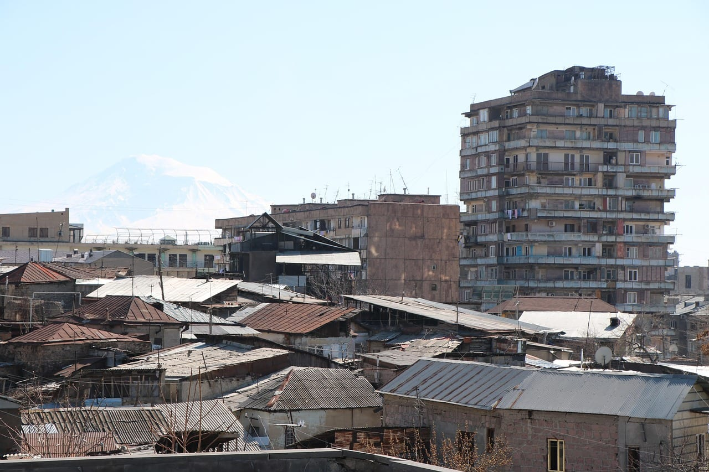

### Анталья, Турция. 46 830 ₽ туда-обратно

Юг Турции зимой — это не море, а сухая солнечная погода и пустой город: отельный пояс закрывается, цены на аренду падают, набережная принадлежит местным. **Виза не нужна: 60 дней за один въезд и 90 суммарно в каждые 180**, загранпаспорт со сроком минимум 120 дней на дату въезда. Для зимовки это означает выезд в декабре или январе — счётчик 90/180 не обходится ничем, кроме вида на жительство, а его по аренде дают неохотно. Второй минус денежный: **карты МИР в Турции не принимают с 2022 года**, нужны наличные или иностранная карта. Медицина платная, счёт за вечер в частной клинике бывает трёхзначным в евро. Разбор регионов и цен — в [гайде по Турции](/blog/turkey-guide-2026/).

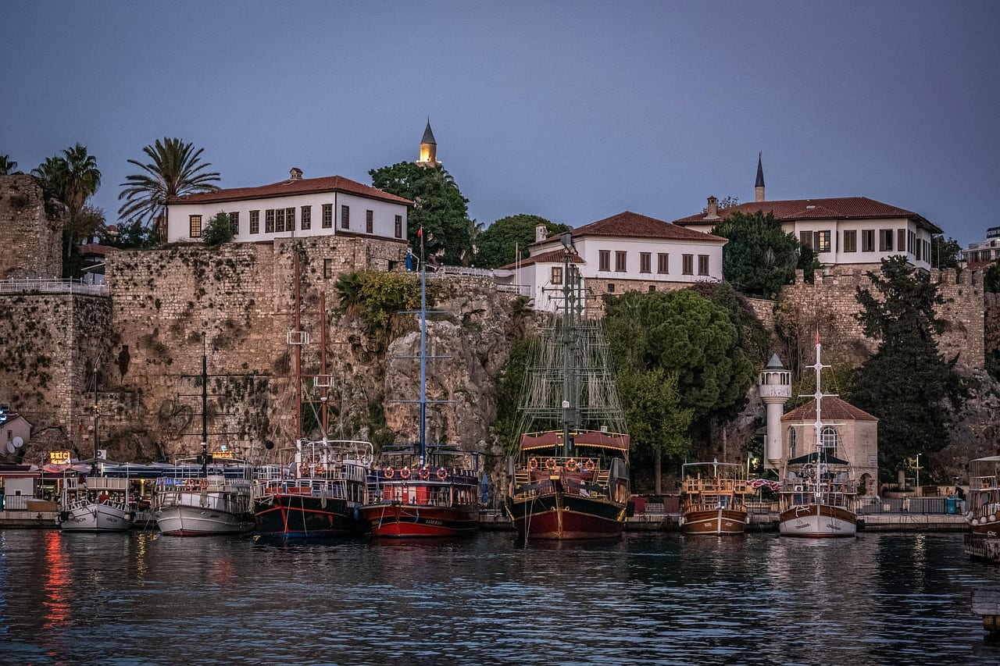

### Батуми, Грузия. 51 585 ₽ туда-обратно

Рекорд списка по сроку: **365 дней подряд без визы**, и счётчик обнуляется любым выездом без ограничения по числу раз. Ни одна другая страна в подборке столько не даёт. Батуми зимой — влажный, ветреный и полупустой приморский город с дешёвой длинной арендой и работающими кофейнями; кто едет за солнцем, разочаруется, кто за тишиной и морем в двух шагах — нет. Обязательное условие с 1 января 2026 года: **медицинская страховка с покрытием не меньше 30 000 лари** (около 969 000 ₽), без неё не посадят на рейс. Российские Visa, Mastercard и МИР не работают — наличные плюс иностранная карта. Детали в [разборе Грузии](/blog/georgia-guide-2026/). <a href={insurance} class="aff-cta" rel="sponsored">Подобрать страховку под грузинское требование</a> — Cherehapa сравнивает полисы, оплата картой РФ, полис приходит в PDF.

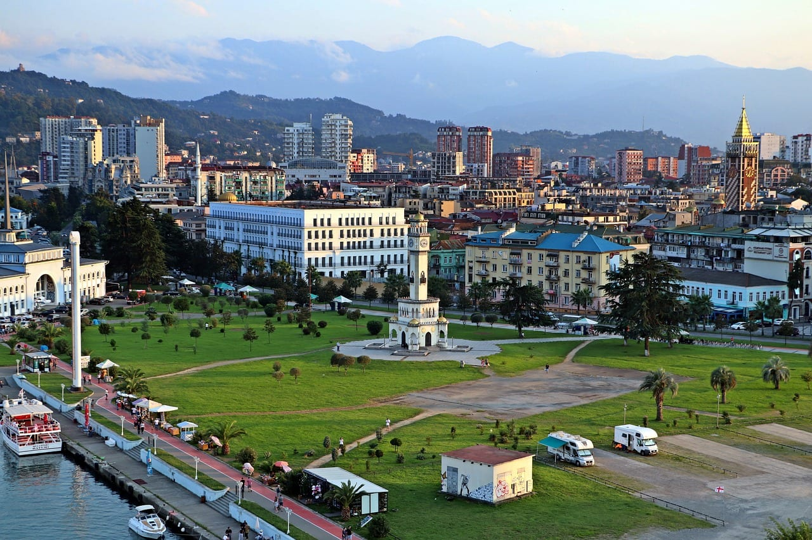

### Хургада, Египет. 56 666 ₽ туда-обратно

Самый недооценённый вариант по срокам. Виза стоит **30 долларов, даёт месяц и продлевается бесплатно ещё на два** в местных миграционных органах — три легальных месяца за тридцать долларов не даёт больше никто в списке. Хургада зимой сухая и ветреная: для кайта это плюс, для купания — как повезёт, вода в январе ощутимо холоднее декабрьской. Город длинный и разбросанный, без машины или привычки к такси жить неудобно. Главный минус — качество воздуха и стройки в новых районах: аренда там дешевле, но соседство с площадкой на три месяца выматывает. Разбор побережий и месяцев — в [гайде по Египту](/blog/egypt-guide-2026/). <a href={hurghadaFlight} class="aff-cta" rel="sponsored">Найти билет Москва — Хургада</a>.

### Дахаб, Египет. 57 016 ₽ туда-обратно

Та же страна, другая жизнь: маленький дайверский городок на Синае без отельного пояса, с дешёвой арендой и общиной удалёнщиков. Лететь надо в Шарм-эль-Шейх, дальше час с небольшим по земле. И вот тут визовая развилка решает всё: **бесплатный «синайский штамп» через Шарм годен 15 дней и только в курортной зоне Южного Синая**, а Дахаб в неё входит. Для зимовки штампа не хватит — берите полноценную визу за 30 долларов, иначе через две недели придётся выезжать. Минусы Дахаба честные: ветер, который дует почти всегда, ограниченный выбор продуктов и медицина уровня «до Шарма час». <a href={sharmFlight} class="aff-cta" rel="sponsored">Найти билет Москва — Шарм-эль-Шейх</a>.

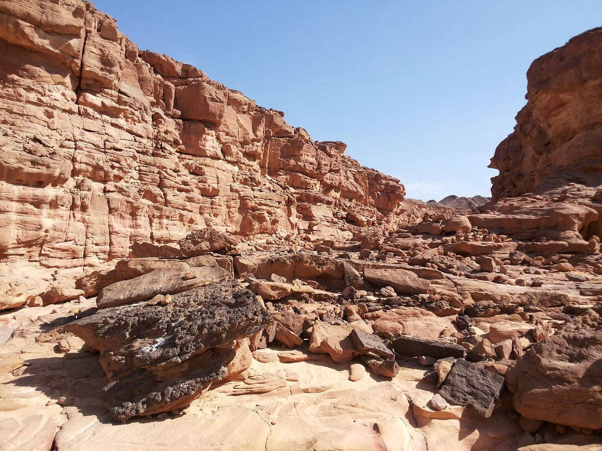

### Агадир, Марокко. 59 587 ₽ туда-обратно

**Безвиз 90 дней** и атлантическая зима: днём тепло, вода холодная круглый год, серфинг вместо купания. Прямых рейсов из России нет с 2021 года, летят со стыковкой через Стамбул и другие хабы, 9–14 часов в пути — это дешёвая по деньгам, но долгая по времени дорога. Главная местная особенность денежная: **дирхам — закрытая валюта**, его не купить заранее и не вывезти, меняют только на месте. Минус Агадира — он новый и безликий: город отстроили после землетрясения 1960 года, старой медины, за которой едут в Марокко, здесь нет, за ней надо ехать в Марракеш или Эс-Сувейру. Маршрут и бюджеты — в [разборе Марокко](/blog/morocco-guide-2026/).

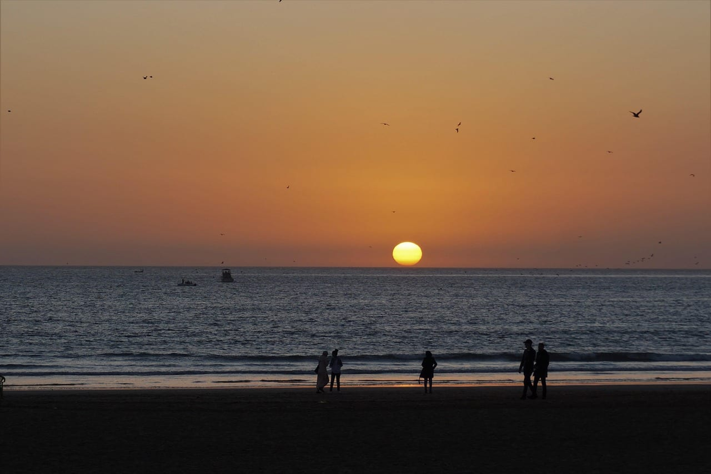

## Ярус 2. Дорога 60 000 – 110 000 ₽

### Подгорица, Черногория. 66 444 ₽ туда-обратно

Единственная точка в списке, которая **закрывается по ходу сезона**. До 31 октября 2026 года включительно всё как было — 30 дней по загранпаспорту; с 1 ноября нужна виза категории C. Сбор 35 €, подтверждение средств 50 € на каждый день, подача только личная в одном из девяти центров, и в большинстве из них приём идёт один-три дня в неделю. Ориентир по срокам — две-три недели. Прямых рейсов из России нет с 2022 года. Зима на Адриатике дождливая и ветреная, но мягкая, а аренда в межсезонье падает вдвое. Если у вас есть действующий шенген, виза США, Великобритании или Ирландии либо ВНЖ в ЕС — **30 дней доступны и после 1 ноября**. Порядок подачи разобран отдельно: [виза в Черногорию](/blog/montenegro-visa-2026/).

### Дубай, ОАЭ. 74 574 ₽ туда-обратно

**90 дней в каждые 180 по бесплатному штампу на границе** — щедро по сроку, но с жёсткой оговоркой: продлевать пребывание внутри страны нельзя с декабря 2022 года, только через выезд. Загранпаспорт нужен со сроком не меньше полугода. Зима — единственный сезон, когда в Эмиратах приятно на улице, и это же высокий сезон аренды: с ноября по март жильё дороже, чем летом. Насколько дороже и как это соотносится с остальными шестнадцатью точками, мы не мерили — своих чисел по аренде у нас нет ни по одной стране списка. Российские Visa и Mastercard не работают. Что делать кроме Дубая и сколько стоит неделя — в [разборе ОАЭ](/blog/uae-guide-2026/). <a href={dubaiFlight} class="aff-cta" rel="sponsored">Найти билет Москва — Дубай</a>.

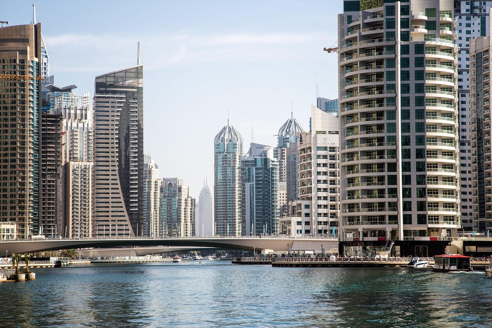

### Маскат, Оман. 76 443 ₽ туда-обратно

Сосед Эмиратов с другим характером: гор больше, торговых центров меньше, людей на порядок меньше. **Безвиз 30 дней за въезд и 90 дней в году** — под долгую зимовку это тесно, зато под два-три месяца с выездами подходит. Сезон совпадает с зимовкой один в один: **с ноября по март дневная норма в Маскате 25–29 °C**, тогда как с мая по сентябрь она держится на 36–39 °C. Минус — цены на еду и аренду ближе к эмиратским, чем к азиатским, и почти полное отсутствие русскоязычной среды, если это для вас важно. Разбор северного и южного календарей — в [гайде по Оману](/blog/oman-guide-2026/).

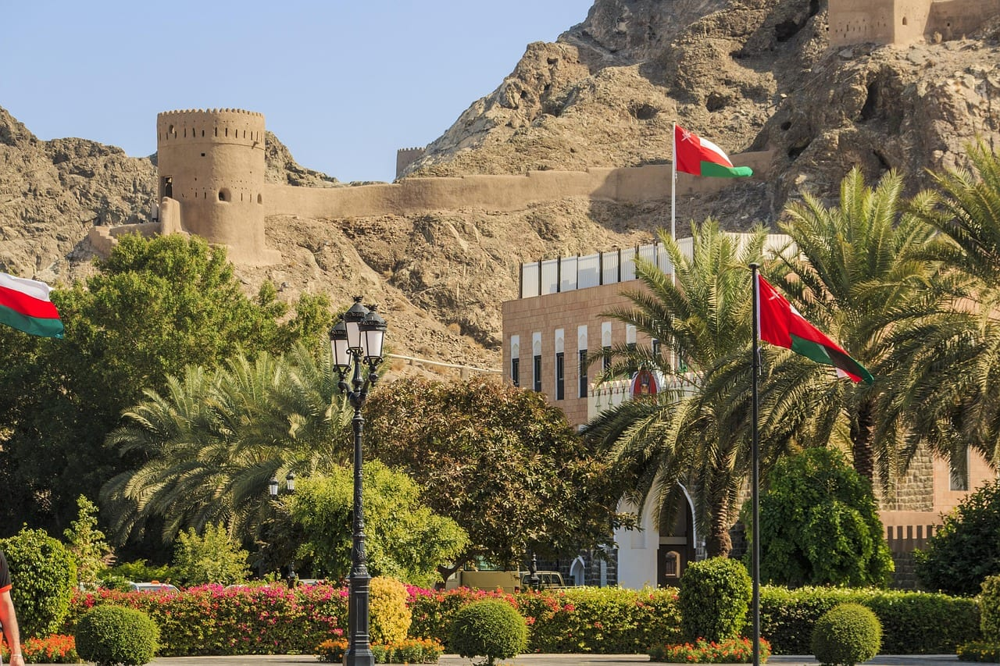

### Пхукет, Таиланд. 108 816 ₽ туда-обратно

Классика зимовки, которая с 15 сентября 2026 года стала неудобнее: **30 дней вместо 60**. Для трёхмесячной зимовки это два выезда вместо одного, и каждый — билет, ночь и нервы на границе. Погодно ноябрь-апрель на Пхукете сухие, это лучшее окно года. Обратный билет в марте — единственный в списке, который дешевле ноябрьского: 50 958 ₽ против 57 858 ₽. Минусы Пхукета известны и не изменились: байк даёт больше всего обращений в клиники, а медицина платная и недешёвая. Сезоны западного и восточного побережья противоположны — [разбор Таиланда](/blog/thailand-guide-2026/) объясняет, почему Самуи в ноябре и Пхукет в ноябре это разная погода. <a href={insurance} class="aff-cta" rel="sponsored">Подобрать страховку на длинный срок</a> — Cherehapa сравнивает полисы, оплата картой РФ, полис приходит в PDF.

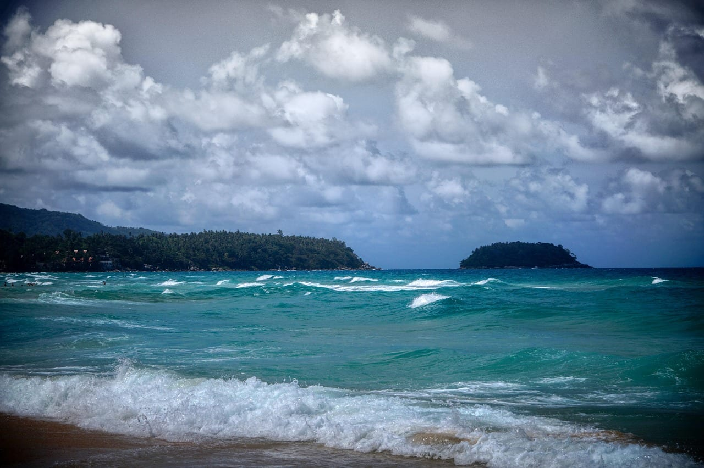

## Ярус 3. Дорога свыше 110 000 ₽

### Чиангмай, Таиланд. 113 347 ₽ туда-обратно

Самая дорогая дорога в тайской части списка: билет сюда выходит на 4 531 ₽ дороже, чем на Пхукет, хотя лететь в глубь материка, а не на остров. Север Таиланда зимой сухой и прохладный ночами, горы вместо моря, большая община удалёнщиков и кофейни на каждом углу. Визовый срок тот же тайский — **30 дней с 15 сентября 2026 года**, и здесь это бьёт больнее, чем на островах: из Чиангмая выезд на границу дальше и дороже. Второй минус жёсткий и сезонный: **с конца февраля по апрель север затягивает дымом от сельскохозяйственных палов**, воздух в отдельные дни становится непригодным для прогулок. Зимовка тут заканчивается раньше календарной весны.

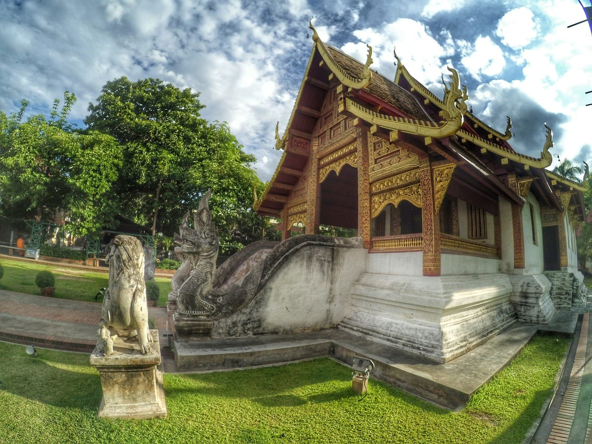

### Гоа, Индия. 113 902 ₽ туда-обратно

**Электронная виза на 30 дней с 1 января 2026 года для россиян бесплатна**, подавать надо минимум за 4 дня до вылета: обработка занимает до 72 часов, окно подачи открывается за 120 дней. Тридцать дней под зимовку мало, и это главное ограничение направления. Сухой сезон точно совпадает с зимой — **ноябрь-март, 0–27 мм осадков, днём +31 °C, вода +27…29 °C**. Прямой рейс из Москвы 7 ч 45 мин, зимнее расписание с 27 октября. Минусы: российские карты не работают, везите наличные доллары; байк — главная причина травм, а медицина платная. Север и юг — две разные поездки, [разбор Гоа](/blog/goa-guide-2026/) их разводит. <a href={goaFlight} class="aff-cta" rel="sponsored">Найти билет Москва — Гоа</a>.

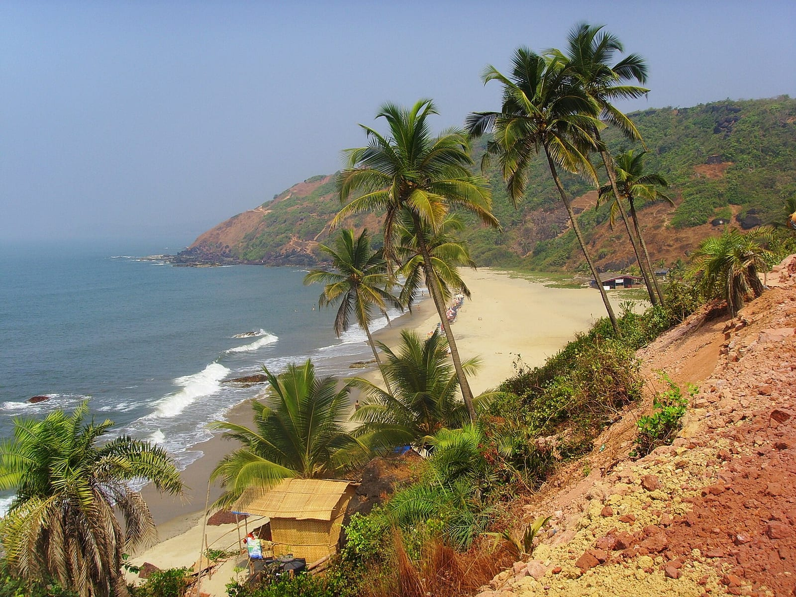

### Коломбо, Шри-Ланка. 118 686 ₽ туда-обратно

**ETA для россиян бесплатная, на 30 дней и с правом двойного въезда** — оформляется заранее на портале электронных разрешений. Двойной въезд для зимовщика важнее, чем кажется: он даёт легальный выезд и возврат без новой оплаты. На острове **два муссона**: с середины ноября по апрель едут на юг и запад, с мая по сентябрь — на восток. То есть зимовка тут привязана не к стране, а к побережью, и переехать в январе на восточный берег значит попасть под дождь. Прямой рейс Аэрофлота около 8,5 часов. Минус — цены на длинную аренду на южном побережье выросли и приблизились к тайским. Детали в [разборе Шри-Ланки](/blog/sri-lanka-guide-2026/).

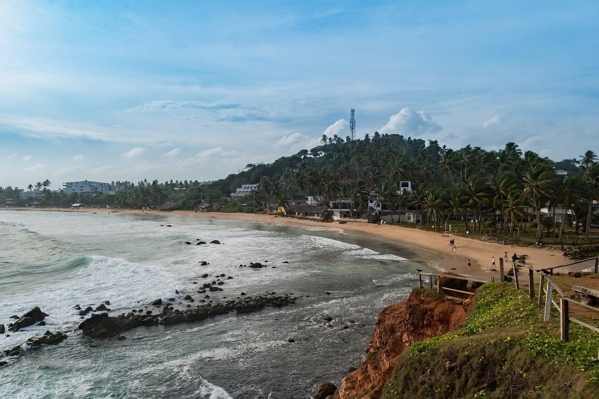

### Бали, Индонезия. 127 652 ₽ туда-обратно

Виза по прибытии стоит **около 32 долларов (500 тыс. рупий) и даёт 30 дней, продлить можно один раз ещё на 30** — итого два месяца. С 1 июня 2025 года продление требует личного визита в миграционную службу, онлайн больше не проходит. Плюс туристический сбор 10 долларов. Главный минус для зимовки — сезон: **дождливый пик приходится на декабрь и январь**, то есть ровно на середину зимовки, и Бали в это время это тёплый ливень каждый день, а не солнце. Кто едет за сушью, приезжает в апреле-октябре — а это не зимовка. Второй минус — пробки и цены в Чангу, выросшие быстрее качества жизни. Районы разобраны в [гайде по Бали](/blog/bali-guide-2026/).

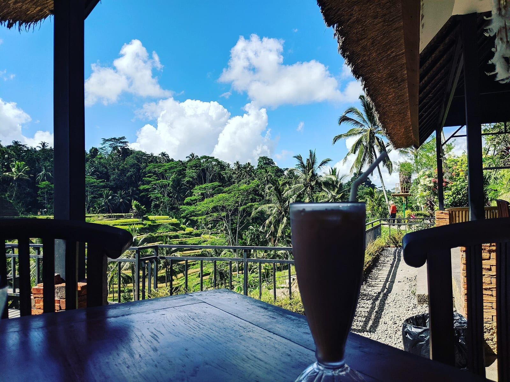

### Себу, Филиппины. 134 989 ₽ туда-обратно

**Безвиз 30 дней и бесплатная анкета eTravel строго за 72 часа до вылета.** Прямых рейсов из России нет, дорога с двумя пересадками — это самая утомительная логистика в подборке. Сезон здесь надо выбирать не по стране, а по острову: **Себу и Бохоль дают дождь ровным слоем весь год с минимумом в марте-мае**, тогда как Палаван и Боракай сухие с декабря по май. То есть зимовщик, приехавший на Себу за сухой зимой, приедет не туда — сухо там будет к концу его срока. Плюсы честные: дайвинг мирового уровня, английский повсеместно, дешёвая еда. Помесячные нормы по шести станциям — в [разборе Филиппин](/blog/philippines-guide-2026/).

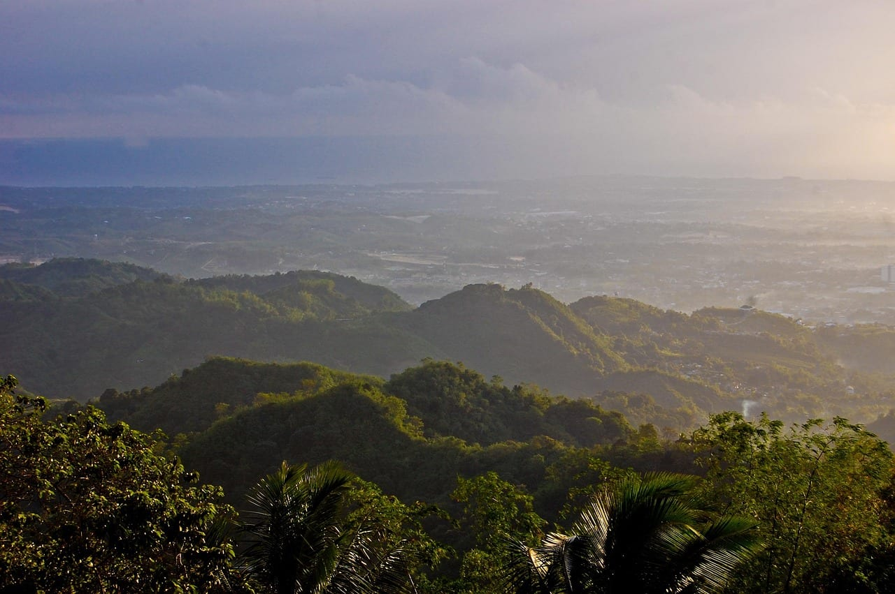

### Дананг, Вьетнам. 136 701 ₽ туда-обратно

Единственная точка списка, где легальный срок можно растянуть **до 90 дней одной бумагой**: безвиз даёт 45 дней и продлён до 14 марта 2028 года, а электронная виза — 90 дней за 25 долларов однократная. Для трёхмесячной зимовки это лучший визовый расклад в Азии после Грузии. Новое правило 2026 года: **электронная карта прибытия нужна всем, кто проходит паспортный контроль**, форма бесплатная и открывается не ранее чем за 72 часа до прилёта. Минус погодный и важный: **центральное побережье, где стоит Дананг, ловит дожди с сентября по декабрь** — начало зимовки придётся пересидеть, а сухо станет к январю. Разбор сроков и карты прибытия — в [визовой странице Вьетнама](/blog/vietnam-visa-2026/). <a href={danangFlight} class="aff-cta" rel="sponsored">Найти билет Москва — Дананг</a>.

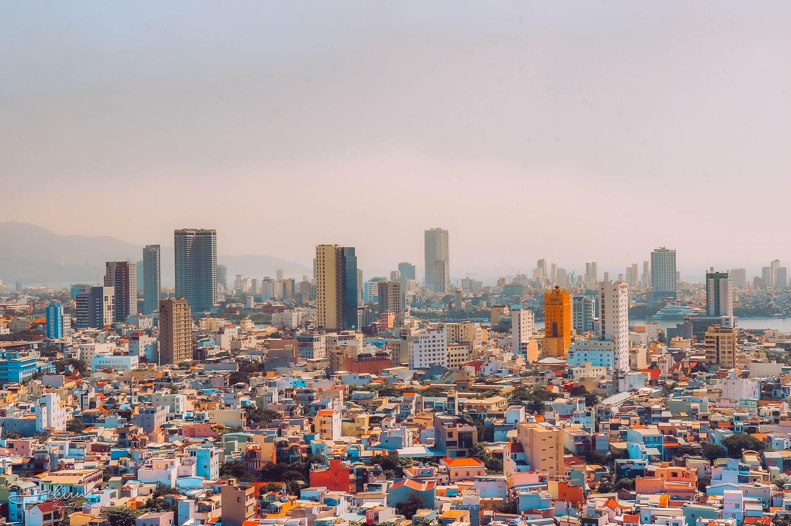

### Пномпень, Камбоджа. 170 079 ₽ туда-обратно

Самая дорогая дорога в подборке и самая пустая страна. Цена снята до Пномпеня — своего аэропорта с рейсами из Москвы у Сиануквиля нет, до него от столицы ещё около 230 км по земле, и этот кусок в сумму не входит. За первое полугодие 2026 года Камбоджа приняла вдвое меньше гостей, чем годом раньше, а Ангкор потерял треть посетителей — храмы стоят полупустыми. **Виза 30 долларов по прилёте на 30 дней**, и по прилёте дешевле, чем онлайн. Сухой сезон с декабря по март совпадает с зимовкой точно. Два жёстких минуса. Первый: **сухопутная граница с Таиландом закрыта с июня 2025 года**, привычная связка «Бангкок — по земле» не работает, лететь придётся, и это как раз то, что делает дорогу такой дорогой. Второй: сам Сиануквиль, куда обычно и едут зимовать, после казинобума остаётся городом-стройплощадкой, и за тишиной перебираются на острова рядом. Контекст — в [разборе Камбоджи](/blog/cambodia-guide-2026/).

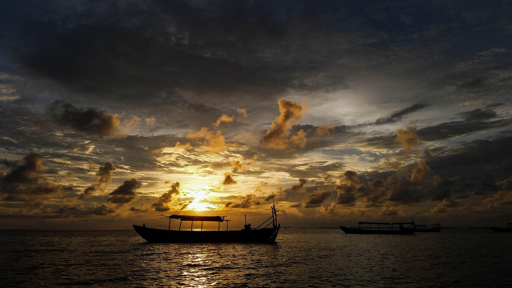

## Что мы не измеряли

Стоимость жизни. В этой статье нет ни одного числа про месячную аренду, еду и интернет — и это не забывчивость. Сводные таблицы цен в сети собирают пользователи, и по семнадцати точкам они расходятся между собой в разы. Поэтому страница честно отвечает на вопрос «сколько стоит вход» — дорога, визовый сбор, страховка — и не отвечает на вопрос «сколько стоит месяц».

Погодные оценки в карточках опираются на разборы соответствующих стран на этом сайте, где числа сняты у метеослужб и датированы. Отдельной выгрузки норм под эту статью я не делал.

## Как я бы выбирал

Сначала срок, потом деньги. Если зимовка на три месяца и без выездов — список короткий: **Грузия, Армения, Марокко, Египет**. Если готовы к одному выезду в середине — добавляются **Вьетнам по e-Visa, ОАЭ и Оман**. Если выезд раз в месяц не пугает — открывается вся Азия, но считайте эти билеты в бюджет заранее, а не «по ходу».

Дальше погода, и тут главная ошибка — брать страну целиком. Бали в декабре и январе мокрый, Дананг мокрый до января, Себу мокрый всегда, а Шри-Ланка зимой сухая только на юге и западе. Из семнадцати точек ровно совпадают с календарём зимовки Гоа, Пхукет, Оман, Камбоджа и Египет.

И только потом дорога. Ярус — это вход, а не жизнь: билет разложит семнадцать точек в один порядок, а три месяца аренды и еды — в какой-то другой, и второго порядка у нас нет. Кто считает бюджет целиком, тот берёт числа из ярусов как первое слагаемое, а не как ответ.

<a href={insurance} class="aff-cta" rel="sponsored">Подобрать страховку на срок зимовки</a> — Cherehapa сравнивает полисы по странам и срокам, оплата картой РФ, полис приходит в PDF. Для Грузии он обязателен по закону с 1 января 2026 года, в остальных точках — вопрос вашего отношения к платной медицине.

## Что пишут те, кто зимовал

Я прочитал три ветки форума Винского — «Зимовка в Таиланде» и «Дауншифтинг, зимовка и жизнь за границей по визе»: четырнадцать сообщений с июня 2024 года по май 2026-го. Это выборка, представительной её считать нельзя, и все суммы ниже — со слов участников, а не проверенные цены.

Ценно там не согласие, а спор о деньгах, и он воспроизводится в каждой ветке. Один участник расписывает бюджет Вьетнама по строкам: дом на месте 30 тысяч рублей в месяц, скутер 5 долларов в день, еда тысяча рублей в день при готовке дома — и получает около 1 200 долларов на месяц. Другой, называющий себя удалёнщиком, отвечает, что меньше 1 500 долларов «на сносную жизнь без излишеств» рассчитывать не стоит, и это **только во Вьетнаме**, а Таиланд выйдет дороже в полтора-два раза, особенно у пляжа. Третий спор — про Шри-Ланку: один пишет, что в Хиккадуве номер с кондиционером в гестхаусе стоит 12 долларов в сутки, то есть 360 в месяц; второй возражает, что в таком номере нет плиты и еда съест разницу; третий уточняет, что в подобных гестах живут по три-пять месяцев, потому что кухня общая.

Из этого спора выводится не цифра, а правило: **разброс оценок месяца по одной и той же стране — двукратный**, и зависит он от того, готовит человек сам или ест в кафе. Считать чужой бюджет своим нельзя ни в ту, ни в другую сторону.

Второе наблюдение — про сроки бронирования. Ветка «Зимовка 2027» открыта в феврале 2026 года вопросом «когда начинать бронировать жильё на январь-февраль 2027», и первый ответ пришёл только в конце мая. Это косвенно говорит о том, что жильё под зимовку ищут гораздо ближе к дате, чем билеты.

## Вопросы

**Какая страна пустит на всю зиму без единого выезда?**
Грузия — 365 дней подряд без визы, счётчик обнуляется любым выездом. Армения — 180 дней в году. Марокко — 90 дней. Египет — месяц по визе за 30 долларов плюс два месяца бесплатного продления в миграционных органах. Остальные двенадцать точек списка требуют либо выезда, либо заранее оформленной визы.

**Правда ли, что Таиланд сократил безвиз?**
Для россиян — да, с 15 сентября 2026 года срок 30 дней вместо 60. Общая безвизовая мера, которую переписала Королевская газета 31 августа, россиян не касается: они въезжают по двустороннему соглашению. Кто прилетел до 14 сентября включительно, сохраняет полученный срок целиком.

**Можно ли зимовать в Черногории в этом сезоне?**
До 31 октября 2026 года — по загранпаспорту на 30 дней. С 1 ноября нужна виза категории C: сбор 35 €, деньги из расчёта 50 € на день, личная подача, ориентир по срокам две-три недели. Исключение — действующий шенген, виза США, Великобритании или Ирландии либо ВНЖ в ЕС: с ними 30 дней доступны и после 1 ноября.

**Где самая дешёвая дорога?**
Ереван — 40 127 ₽ туда-обратно на окно «ноябрь 2026 — март 2027», замер 7 сентября 2026 года. Дальше Анталья 46 830 ₽ и Батуми 51 585 ₽. Самая дорогая — Пномпень, 170 079 ₽.

**Почему в статье нет цен на аренду?**
Потому что мы их не мерили. Чужие сводные таблицы стоимости жизни собираются пользователями и не датируются, а своей выборки объявлений по семнадцати точкам мы не делали. Называть такие числа как проверенные было бы обманом.
